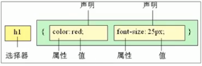
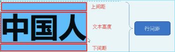

## CSS层叠样式表

### CSS简介

主要使用场景是美化网页

html局限性

1. 只将网络显示出来
2. 可以做简单样式，但比较繁琐

CSS是层叠样式表(Cascading Style Sheets）简称

也称为级联样式表 css也是一种标记语言

主要用于设置文字内容字体 大小 对齐方式等等

#### 1.1 css语法规范

css规则由两部分组成：**选择器及一条或多条声明**



```html
<!DOCTYPE html>
<html lang="en">
<head>
    <meta charset="UTF-8">
    <meta http-equiv="X-UA-Compatible" content="IE=edge">
    <meta name="viewport" content="width=device-width, initial-scale=1.0">
    <sylte>
        p {
        	color: red;
        	font-size: 25px;
        }
    </sylte>
    <title>css样式测试</title>
</head>
<body>
    <p>
        Some articals.
    </p>
</body>
</html>
```

#### 1.2 css代码风格

1. 紧凑型

   ```html
   h3 { color: deepink;font-size: 20px;}
   ```

2. 展开格式

   ```css
   h3 {
   	color: pink;
       font-size: 20px;
   }
   ```

   

样式大小写 一般采取小写字母

3. 空格规范

   :后接空格 选择器和{}保留空格 

### CSS选择器

#### 2.1 css选择器作用

根据不同需求将不同标签选择出来。

#### 2.2 选择器分类

基础选择器与复合选择器

1.标签选择器

```html
<style>
    p {
        color: green;
    }
</style>
```

将页面中所有同类型标签设置统一样式

2.类选择器

单独选择一个或某几个标签

```css
.类名 {
    属性1: 属性值;
    ...
}
```

```html
<div class="类名">
    ...
</div>
```

命名随意 但不能与标签名相同 不能使用纯数字 命名要有意义

3.类选择器--多类名

给一个标签指定多个类名，从而达到更多选择目的，这些类名都可以选出这个标签。

```html
<div class="类1 类2"></div>
```

4.id选择器

id选择器可以为标有特定id的元素指定样式

元素以id属性来设置id选择器，css中id选择器以“#”定义。

```css
#id {
    属性1: 值;
    ...
}
#nav {
    color: red;
}
<div id="nav"></div>
```

与类区别：只能调用一次 一般用于页面唯一性的元素上，配合js使用。

5,通配符选择器

 ```css
 * {
     属性1: 值;
     ...
 }
 ```


用于选取页面中所有元素 

清除内外边距

```css
* {
    margin: 0;
    padding: 0;
}
```


#### 2.3 总结

| 基础选择器   | 作用                            | 特点                               | 使用情况                  | 用法               |
| ------------ | ------------------------------- | ---------------------------------- | ------------------------- | ------------------ |
| 标签选择器   | 可以选择出所有标签              | 不能差异化选择                     | 较多                      | p {color: red;}    |
| 类选择器     | 可以选择一个或多个标签          | 可以根据需求选择                   | 非常多                    | .nav {color: red;} |
| id选择器     | 一次只能选一个标签              | 单个id属性只能在html文档里出现一次 | 与js搭配                  | #nav {color: red;} |
| 通配符选择器 | 选择所有标签包括html body title | 全部选择                           | 特殊情况（如去除内外边距) | * {color: red;}    |

### CSS字体属性

#### 3.1 字体系列

使用font-family属性定义文本字体系列

```css
p {font-family: "微软雅黑";}
body {font-family: Arial, "Microsoft Yahei", "微软雅黑";}
```

#### 3.2 字号大小

使用font-size指定字体大小

```css
p {
    font-size: 20px;
}
```

当给body指定字体大小时标题标签需要单独指定

#### 3.3 字体粗细

使用font-weight指定字体粗细

| 参数    | 作用                                                        |
| ------- | ----------------------------------------------------------- |
| normal  | 正常字体。相当于number为400。声明此值将取消之前的任何设置。 |
| bold    | 粗体。number为700，也可相当于b对象的作用。                  |
| bolder  | 特粗体                                                      |
| lighter | 细体                                                        |
| number  | 100~900                                                     |

#### 3.4 文字样式

使用font-style设置字体风格

```css
p {
    font-style: normal;
}
```

| 属性值 | 作用                             |
| ------ | -------------------------------- |
| normal | 默认值，浏览器显示标准的字体样式 |
| italic | 斜体                             |

不常使用斜体，而是经常将<em> <i>标签等倾斜的字体纠正

#### 3.5 字体复合属性

```css
div {
    font-style: italic;
    font-weight: 700;
    font-size: 16px;
    font-family: Arial;
}
```

为了简化以上代码，使用如下方式定义字体属性

```css
div {
    font: font-style font-weight font-size/line-height font-family;
}
div {
    font: italic 700 16px/20px Arial;
}
```

属性可以省略，但至少包括font-size和font-family属性，否则将不起作用

#### 3.6 字体总结

| 属性        | 表示     | 注意                                             |
| ----------- | -------- | ------------------------------------------------ |
| font-size   | 字号     | 单位为像素px，必须有单位                         |
| font-family | 字体     | 按照团队约定设置字体                             |
| font-weight | 字体粗细 | 加粗为700或bold 不加粗为normal或400 数字没有单位 |
| font-style  | 字体样式 | 倾斜为italic 不倾斜为normal 常用normal           |
| font        | 字体连写 | 字体属性有顺序 不能换位 字号与字体必须同时出现   |

### CSS文本属性

定义文本外观样式，如文本颜色，对齐文本，装饰文本，文本缩进，行间距等。

#### 4.1 文本颜色

color 用于定义文本颜色

```css
div {
    color: red;
}
```

| 表示         | 属性值                             |
| ------------ | ---------------------------------- |
| 预定义颜色值 | red, green, blue, pink, deeppink等 |
| 十六进制     | #FF0000, #FF6600, #29D794          |
| RGB代码      | rgb(255, 0, 0)或rgb(100%, 0%, 0%)  |

 #### 4.2 对齐文本

text-align设置元素内文本内容的水平对齐方式

```css
div {
    text-align: center;
}
```

| 属性值 | 作用           |
| ------ | -------------- |
| left   | 左对齐（默认） |
| right  | 右对齐         |
| center | 居中对齐       |

#### 4.3 装饰文本

text-decoration 属性规定添加到文本的修饰。可以给文本添加下划线、删除线、上划线等。

```css
p {
    text-decoration: underline;
}
```

| 属性值       | 作用                            |
| ------------ | ------------------------------- |
| none         | 默认，没有装饰线（最常用）      |
| underline    | 下划线，链接a自带下划线（常用） |
| overline     | 上划线，几乎不用                |
| line-through | 删除线，不常用                  |

#### 4.4 文本缩进

text-indent 属性用来定义文本第一行的缩进

```css
p {
    text-indent: 20px;
    或者
    text-indent: 2em;
}
```

对文本首行进行几个像素的缩进

em是一个相对单位，当前元素 font-size 一个文字的大小 如果没有设置大小 则按照父元素的一个文字大小。

#### 4.5 行间距

line-height 用于定义行之间的距离，可以控制文字行与行之间的距离。

```css
p {
    line-height: 10px;
}
```



注意 行间距包括上间距下间距和文本高度

#### 4.6 文本属性总结

| 属性            | 表示     | 注意                                        |
| --------------- | -------- | ------------------------------------------- |
| color           | 文本颜色 | 通常使用十六进制 且为简写如#fff             |
| text-align      | 文本对齐 | 设定文字水平对齐方式                        |
| text-indent     | 文本缩进 | 设定段落首行缩进                            |
| text-decoration | 文本修饰 | 添加下划线underline 删除下划线 none         |
| line-height     | 行高     | 控制行与行之间的距离 包括上下间距和文本高度 |

### CSS引入方式

1.行内样式表（行内式）

2.内部样式表（嵌入式）

3.外部样式表（链接式）

#### 5.1 内部样式表

将样式表写在html内部 放入style标签中

```html
<style>
    p {
       ..... 
    }

</style>
```

style标签理论上可以放在html的任何地方，但一般会放在文档的\<head>标签中

控制整个html页面 也叫嵌入式引入

#### 5.2 行内样式表

在元素标签内部的style属性设定css样式，适合简单的修改样式

```html
<div style="color: pink;">
    ...
</div>
```

style是标签的属性 在双引号之间要符合css规范 只控制其中一个标签 叫做行内式引入

#### 5.3 外部样式表

实际开发中都是外部样式表，适合样式比较多的情况。核心是将样式单独写到css文件中，之后将css文件引入到html中。

在html中使用\<link>标签引入css文件

```html
<link rel="stylesheet" href="style.css">
```

两个属性解释如下

| 属性 | 作用                                                         |
| ---- | ------------------------------------------------------------ |
| rel  | 指定当前文档与被链接文档的关系，当指定为“stylesheet”时表示被链接的文档是一个样式表文件。 |
| href | 定义所链接的外部文件的url，可以为相对路径或绝对路径。        |

使用外部样式表设定css，通常被称为外链式或链接式引入，这种方式是开发中常用的方式

#### 5.4 总结

| 样式表     | 优点                 | 缺点             | 使用情况    | 控制范围     |
| ---------- | -------------------- | ---------------- | ----------- | ------------ |
| 行内样式表 | 书写方便，权重高     | 结构样式混写     | 较少        | 一个标签     |
| 内部样式表 | 部分结构和样式分离   | 没有彻底分离     | 较多 练习用 | 一个html页面 |
| 外部样式表 | 实现结构样式完全分离 | 需要引入一个文件 | 最多        | 多个页面     |

