##  CSS进阶

###  Emmet语法

Emmet语法的前身是Zencoding，他使用缩写，来提高html/css的编写速度，vscode内部集成该语法。

#### 1.1 快速生成HTML结构语法

1. 生成标签直接输入标签名按tab即可 例如 div按tab键就可以生成\<div>\</div>
2. 如果想要生成多个相同标签，加上* 例如 div*3 可以生成三个\<div>\</div>
3. 如果有父子级关系的标签可以用 > 例如 ul>li
4. 如果有兄弟关系的标签，用 + 例如div+p
5. 如果生成带有类名或者id的，直接写.demo或者#two tab就可以 或者 p.one p#one生成其他标签
6. 如果生成的div类名有顺序，可以用自增符号$
7. 按！加tab 生成基本骨架
8. 在生成的标签内部写内容用{ }
8. 生成带有type="text"的input标签：input:text
10. 生成随机长字符串 lorem 可以lorem*n

自增符号

```html
.demo$*5生成5个带有demoX类的div标签
<div class=“demo1"></div>
```

#### 1.2 快速生成CSS样式语法

1. 例如 w200 tab 生成width: 200;
2. 例如 lh26 tab 生成line-height: 26px;

#### 1.3 快速格式化代码

在vscode中右键>格式化文档 或者Alt Shift L （安装了vim的插件为 Ctrl Alt L)

可设置主动保存时自动格式化代码

### CSS的复合选择器

#### 2.1 什么是复合选择器

在CSS中，可以根据选择器的类型分为基础选择器和复合选择器，复合选择器建立在基础选择器之上，对基础选择器进行组合形成的。

* 复合选择器可以更准确、更高效选择目标元素。
* 复合选择器是由两个或多个基础选择器，通过不同方式组合而成的。
* 常用复合选择器包括：后代选择器、子选择器、并集选择器、伪类选择器等

#### 2.2 后代选择器（重要）

后代选择器又称为包含选择器，可以选择父元素里面的子元素。其写法就是将外层标签写在前面，内层标签写在后面名中间用**空格**分隔。但标签发生嵌套时，内层标签就称为外层标签的后代。

```css
元素1 元素2 ... {属性值}
```

其中元素1和元素2可以是任何一个基础选择器。

```css
/* 选择ol里的li */
ol li {
    color: red;
    ...
}
```

```css
/* 当存在多个相同标签时，可结合类进行区分 */
.nav li {
    color: red;
    ...
}
/* 选择带有.nav的标签下的li */
```

#### 2.3 子选择器（重要）

子元素选择器只能选择作为某元素的最近一级子元素。

```css
元素1 > 元素2 {
    color: red;
    ...
}
/* 该方法只能选择最近一z子元素 例如 <元素1> <元素2></元素2> </元素1>*/
```

#### 2.4 并集选择器（重要）

并集选择器可以选择多组标签，同时定义他们为相同样式，通常用于集体声明。

```css
元素1， 
元素2, ... {
    color: red;
    ...
}
p,
div {
    color: red;
}
p,
div,
.pig li {
    color: red;
}
```

并集选择器使用**逗号**分割任何形式的选择器都可作为并集选择器的一部分。

#### 2.5 伪类选择器

伪类选择器用于向某些选择器添加特殊的效果，比如给链接添加特殊效果，或选择第一个，第n个元素。

用冒号（  :  ）表示, 例如:hover :first-child          ~~在此发现了markdown好玩的东西 :sa: :alien:~~

伪类选择器又分为链接伪类，结构伪类等

##### 2.5.1 链接伪类选择器

* a:link 选择所有未被访问的链接
* a:visited 选择所有已被访问的链接
* a:hover 选择指针选择的链接
* a:active 选择活动的链接 鼠标按下未弹起

链接伪类注意事项

1. 为保证生效，按照LVHA的顺寻声明:link :visited :hover :active
2. a标签在浏览器中有默认样式，所以我们在实际工作中都需要给链接单独指定样式。

##### 2.5.2 focus伪类选择器

:focus伪类选择器用于选取获得焦点的表单元素

焦点就是光标，一般情况下\<input>类表单才能获取，因此这个选择器也主要针对表单元素来说。

```css
input:focus {
    background-color: red;
    ...
}
```

#### 2.6 复合选择器总结

| 选择器            | 作用                 | 特征               | 使用情况 | 分隔符及用法          |
| ----------------- | -------------------- | ------------------ | -------- | --------------------- |
| 后代选择器        | 用来选择后代元素     | 可以是子孙后代     | 较多     | 空格 .nav a           |
| 子代选择器        | 选择最近一级元素     | 只选择第一级子元素 | 较少     | >    .nav>p           |
| 并集选择器        | 选择相同样式元素     | 集体声明           | 较多     | .nav, .header         |
| 链接伪类选择器    | 选择不同状态的链接   | 与链接相关         | 较多     | 只需掌握a{ }与a:hover |
| input:focus选择器 | 选择被鼠标选中的表单 | 与表单相关         | 较少     | input:focus           |

### CSS的元素显示模式

了解元素显示模式可以让我们更好地布局页面。

1. 什么是元素的显示模式
2. 元素显示模式的分类
3. 元素显示模式的转换

#### 3.1 什么是元素显示模式

 作用：网页标签非常多，在不同的地方用到不同标签，了解他们的特点可以更好布局网页。

元素显示模式就是元素以什么方式显示，比如div独占一行，一行可以放多个span。

html元素一般分为**块元素**和**行内元素**两种类型

##### 3.1.1 块元素

常见块元素有标题\<hX>标签、p标签、div标签、ul标签、ol标签、li标签等，其中div标签是最典型的块元素。

块元素的特点：

1. 独占一行。
2. 高度 宽度 外边距及内边距可以控制。
3. 宽度默认是容器（父级宽度）的100%
4. 是一个容器及盒子，里面可以放行内或块元素。

**注意**

* 文字类元素不能使用块级元素
* p标签主要用于存放文字，因此p标签内不能放块级元素，尤其是div
* 同理，hX标签等都是文字类块级标签，里面也不能放其他块级元素

##### 3.1.2 行内元素

常见行内元素有 a , strong, b, em, i, del, s, ins, u, span等，其中span是最典型的行内元素，有的地方将行内元素称为内联元素。

行内元素的特点：

1. 相邻行内元素在一行上，一行可显示多个。
2. 高、宽直接设置无效。
3. 默认宽度就是他本身内容宽度。
4. 行内元素只能容纳文本或其他行内元素。

**注意**

1. 链接里不能放链接
2. 特殊情况a变迁可以放块级元素，但是给a转换一下块级模式更安全。（书上这么写的，我不明白安全是什么

##### 3.1.3 行内块元素

行内元素中有几个特殊的标签：\ \<input /> \<td>， 他们同时具有块元素和行内元素的特点。

有些资料称他们为行内块元素。

行内块元素的特点：

1. 和相邻的行内元素（行内块）在一行上，但他们之间有空白缝隙，一行可以显示多个（行内元素的特点）。
2. 默认宽度就是其本身内容的宽度（行内元素特点）。
3. 高度、行高、内外边距都可控制（块元素的特点）。

#### 3.2 元素显示模式总结

| 元素模式   | 元素排列   | 设置样式           | 默认宽度     | 包含                    |
| ---------- | ---------- | ------------------ | ------------ | ----------------------- |
| 块级元素   | 一行放一个 | 可以设置宽高       | 容器的100%   | 容器级 可以包含任意标签 |
| 行内元素   | 一行放多个 | 不可以直接设置宽高 | 本身内容宽度 | 容纳文本或其他行内元素  |
| 行内块元素 | 一行放多个 | 可以设置宽高       | 本身内容宽度 | ~                       |

#### 3.3 元素显示模式的转换

特殊情况下，我们需要元素模式的转换，例如\<a>标签，可以将其转化为块级元素。

转化为块级元素

```css
a {
    display: block;
}
```

转化为行内元素

```css
div {
    display: inline;
}
```

转化为行内块元素

```css
span {
    display: inline-block;
}
```

#### 3.4 文字垂直居中

**让元素的行高等于盒子的高度使文字垂直居中**

原理

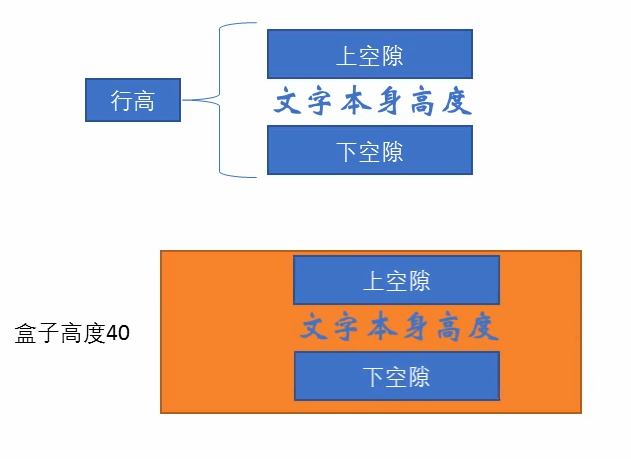

### CSS的背景

通过css背景属性，可以给元素添加背景样式。

背景属性可以设置背景颜色、背景图片、背景平铺、背景图片位置、背景图像固定等。

#### 4.1 背景颜色

background-color定义背景颜色。

```css
div {
    bacground-color: transparent/color;
    /* 默认是透明可以指定颜色 */
}
```

#### 4.2 背景图片

background-image设置背景图片。常见在logo或者背景图片。便于控制位置。

```css
background-image: none | url(url);
background-image: url(images/logo.png);
```

#### 4.3 背景平铺

如果需要在html页面上对背景图片进行重复平铺，可以使用background-repeat属性。

```css
background-repeat: repeat | no-repeat | repeat-x | repeat-y ;
```

#### 4.4 位置控制

利用background-position属性可以改变图片位置。

```css
background-position: x y;
```

参数分别对应横纵坐标可以使用方位名词或者精确单位。

| 参数     | 说明                                                        |
| -------- | ----------------------------------------------------------- |
| length   | 百分数 \| 由浮点数和单位标识符组成的长度值                  |
| position | top \| center \| bottom \| left \| center \| right 方位名词 |

注意 如果使用方位名词 则不分横纵 参数写在x或者y的效果一样 可以换位

当只指定一个方向上的方向名词 另一个不指定则默认为居中

例如

```css
/* 顶部水平居中 */
background-position: top;
/* 右侧垂直居中 */
background-position: right;

```

当使用精确单位时x y坐标不可交换位置 只指定一个数值时默认为x 另一个垂直居中

单位可以混合例如

```css
background: 10px center;
```

其xy坐标同样不可调换

#### 4.5 背景图像固定（背景附着）

background-attachment属性设置背景图像是否固定或者随着页面的其余部分滚动。

该属性可以制作视差滚动的效果。

```css
background-attachment: scroll | fixed ;
```

| 参数   | 效果                     |
| ------ | ------------------------ |
| scroll | 背景图像随着对象内容滚动 |
| fixed  | 背景图像固定             |

#### 4.6 背景复合写法

为了简化背景属性的代码，我们可以将这些属性合并写在同一个属性background中。

```css
background: bgc bgi bgr bga bgp;
```

与字体连写不同，背景连写没有特定的顺序，但一般约定为：颜色 图片 平铺 滚动 位置

例如

```css
background: transparent url(logo.jpg) no-repeat fixed center top;
```

#### 4.7 背景色半透明

CSS3为我们提供了背景颜色半透明的效果。

```css
background: rgba(0, 0, 0, 0.3); /* 四个属性分别对应red green blue alpha */
```

最后一个参数是alpha值，取值在0~1之间。

习惯写法可以将0.3的0省略 写作.3

```css
background: rgba(0, 0, 0, .3);
```

背景半透明指的是盒子背景颜色半透明，盒子里的内容不受影响。

#### 4.8 背景总结

| 属性                  | 作用     | 值                                                      |
| --------------------- | -------- | ------------------------------------------------------- |
| background-color      | 背景颜色 | 预定义的颜色值/十六进制/RGB/RGBA代码                    |
| background-image      | 背景图片 | url(图片路径)                                           |
| background-repeat     | 是否平铺 | repeat/no-repeat/repeat-x/repeat-y                      |
| background-position   | 背景位置 | lenth/position 对应为xy坐标                             |
| background-attachment | 背景附着 | scroll 滚动 fixed固定                                   |
| 背景简写              | 简化书写 | 颜色 url 平铺 滚动 位置                                 |
| 背景色半透明          | 半透明   | background: rgba(0, 0, 0, 0.3); 可修改alpha值更改透明度 |

  ### CSS的三大特性

三大特性：层叠性、继承性、优先级。

#### 5.1 层叠性

相同选择器设置相同样式，此时一个样式就会覆盖（层叠）另一个冲突的样式，层叠性主要解决样式冲突问题。

层叠性原则：

* 样式冲突，遵循的原则是就近原则，哪一个样式离结构近，就执行哪个样式。（就像css代码由上至下执行）
* 样式不冲突不会重叠。

#### 5.2 继承性

css中的继承：子标签会继承父标签的某些样式，如文本颜色字号。

* 恰当地使用继承可简化代码，降低css样式复杂性
* 子元素可以继承父元素的样式：text- font- line-开头的属性 以及color属性

行高的继承

```css
body {
    font: 12px/1.5 Microsoft YaHei;
}
```

1.5表示让行高为当前文字大小的1.5倍。 

#### 5.3 优先级

当给同一个元素指定同一个属性，每个定义有优先级。

* 选择器相同，则执行层叠性
* 选择器不同，根据选择器权重进行

|         选择器          | 选择器权重 |
| :---------------------: | ---------- |
| 继承 或者 *通配符选择器 | 0,0,0,0    |
|       元素选择器        | 0,0,0,1    |
|   类选择器 伪类选择器   | 0,0,1,0    |
|        ID选择器         | 0,1,0,0    |
|    行内样式style=""     | 1,0,0,0    |
|    !important重要的     | 无穷大     |

!important使用

```css
div {
    color: pink!important;
}
```

注意

1. 权重是由四组数字组成的 但不会有进位 从左到右依次比较
2. 类选择器永远大于元素选择器 id选择器永远大于类选择器 以此类推
3. 继承的权重为零，如果该元素没有被直接选中，不管父元素权重有多高 ，子元素得到的权重都是0
4. a链接是由浏览器默认定义了一个样式 大于继承自body的属性 故单独在body中指定属性不能达到预期效果

权重叠加

如果是复合选择器，则会有权重叠加的现象

```css
ul li {
    color: green;
}
li {
    color: red;
}
/* 两次定义顺序的调换排除了层叠性的影响 权重叠加使第一次定义起了效果 */
```

权重相加方式

例如ul li 0,0,0,1 + 0,0,0,1 = 0,0,0,2

.nav li 0,0,0,1 + 0,0,1,0 = 0,0,1,1

由于永远不会有进位问题 那么就会出现类选择器永远大于任何几个标签选择器叠加 其他选择器以此类推

### CSS盒子模型

目标：

* 能够准确阐述盒子的四个组成部分
* 能够利用边框复合写法给元素添加边框
* 能够计算盒子大小
* 能够利用盒子模型布局案例
* 能够给盒子设置圆角边框
* 能够给盒子添加阴影
* 能够给文字添加阴影

#### 6.1 盒子模型

页面布局三大核心，盒子模型，浮动定位，学习盒子模型能更好帮助我们布局页面。

##### 6.1.1 看透网页布局本质

网页布局过程：

1. 先准备好相关网页元素，网页元素基本都是盒子box。
2. 利用css设置好盒子样式，然后摆放到相应位置。
3. 向盒子里装内容。

网页布局核心：利用CSS盒子

##### 6.1.2 盒子模型组成

所谓盒子模型 就是把html页面中的布局元素看作一个矩形的盒子，也就是一个装内容的容器。

CSS盒子模型本质上是一个盒子，封装周围的html元素，其包括边框、外边距、内边距、和实际内容。

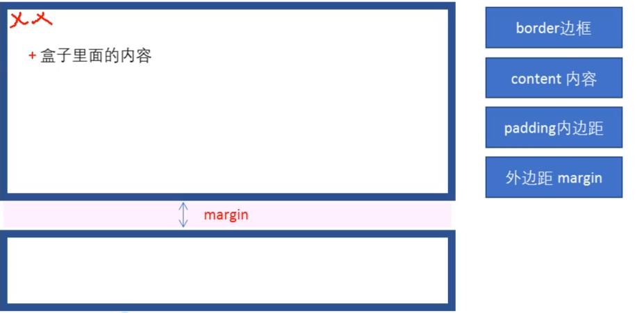

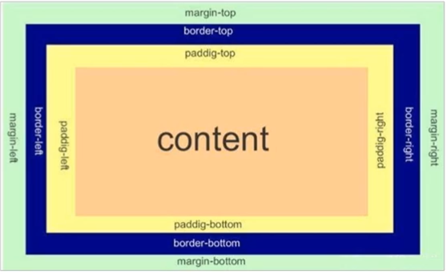

#### 6.2 边框(border)

通过boder属性设置元素边框。边框由三部分组成：边框宽度（粗细）边框样式 边框颜色。

```css
border: border-width || border-style || border-color
```

| 属性         | 作用                 |
| ------------ | -------------------- |
| border-width | 定义边框粗细，单位px |
| border-style | 边框样式             |
| border-color | 边框颜色             |

边框简写：

```css
border: 1px solid red; /* 各属性之间没有顺序 */
```

边框分开写法

```css
/* 上边框 */
border-top: 1px solid red;
```

#### 6.3 表格的细线边框

border-collapse属性控制浏览器绘制表格边框方式。他控制相邻单元格的边框。

作用是合并相邻边框防止边框叠加导致变粗

边框会影响盒子实际大小

边框会额外增加盒子的实际大小。因此我们由两种方案解决：

1. 测量盒子大小的时候，不量边框。
2. 测量时包含了边框，则需要width/height减去边框宽度。

#### 6.4 内边距（padding）

该属性用于设置内边距，即边框与内容之间的距离。

```css
padding: 5px;
padding-left: 5px; /* 设置左内边距 其他方位名词同理 */
```

| 值的个数                     | 作用                                                         |
| ---------------------------- | ------------------------------------------------------------ |
| padding: 5px;                | 1个值，代表上下左右都有5个像素的内边距                       |
| padding: 5px 10px;           | 2个值，代表上下内边距是5 左右内边距是10                      |
| padding: 5px 10px 20px;      | 3个值，代表上内边距5像素，左右内边距10像素，下边距20像素 由上至下 |
| padding: 5px 10px 20px 30px; | 4个值，代表上5 右10 下20 左30 顺时针定义                     |

padding也会影响盒子大小 

特殊情况

如果盒子本身没有指定width/height 属性，则此时padding不会撑开盒子。

#### 6.5 外边距（margin）

margin属性用于设置外边距，即控制盒子与盒子之间的距离。

属性与padding相同，有margin-left margin-top等四个方位的定义。

典型应用：外边距还可以让块级盒子水平居中，但必须满足两个条件：

1. 块级盒子必须指定宽度。
2. 盒子左右外边距都设置为auto

此外还可以通过给其父元素添加text-align: center;来将行内或者行内块元素水平居中。 

#### 6.6 外边距合并

使用margin定义块元素的垂直外边距时，可能会出现外边距的合并。

主要有两种情况

1. 相邻块元素垂直外边距合并

   当上下相邻的两个块元素（兄弟关系）相遇时，如果上面的元素有下外边距margin-bottom，下面的元素有上外边距margin-top，则他们之间的垂直间距不是margin-bottom和margin-top之和。取**两个值中的较大者**这种现象叫做相邻块元素垂直外边距的合并。

   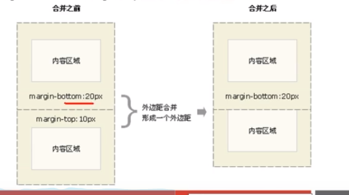

   尽量只给一个盒子添加外边距值

2. 嵌套块元素垂直外边距的塌陷

对于两个嵌套关系的块元素，父元素有上外边距同时子元素也有上外边距，此时父元素会塌陷较大的外边距值。

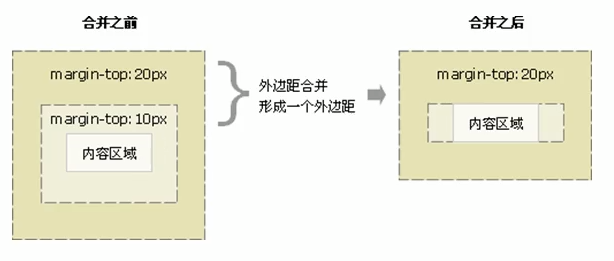

解决方案

1. 给父元素指定定义上边框
2. 给父元素定义上内边距
3. 为父元素添加overflow: hidden;

清除内外边距

网页元素很多都自带内外边距，而且不同浏览器默认的也不一致。因此我们在布局前，首先要清除一下网页元素的内外边距。

```css
* {
    padding: 0;
    margin: 0;
}
```

注意：行内元素为了考虑兼容性，尽量只设置左右内外边距，不要设置上下内外边距。但是转换为块级和行内块元素就可以了。

##### 附加

案例新知识: 去掉li前面的项目符号（圆点）

语法

```css
list-style: none;
```

#### 6.7 圆角边框

css3以后支持。

border-radius属性用于设置元素的外边框圆角。

```css
border-radius: lenth;
```

radius半径（圆的半径）原理：（椭）圆与边框的交集形成圆角效果。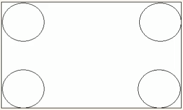

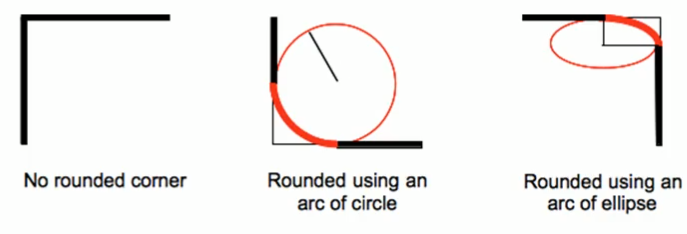

参数值可以为数值或者百分比形式

* 当border-radius等于正方形盒子边长的一半会得到一个圆。
* 当border-radius等于矩形盒子高度的一半会得到一个圆角矩形。
* 该属性是一个简写属性，可以写四个值，分别代表左上角 右上角 右下角 左下角 顺时针排列。
* 分开写：border-top-left-radius border-top-right-radius border-bottom-right-radius border-bottom-left-radius

#### 6.8 盒子阴影

同样是css3 可以使用box-shadow属性为盒子添加阴影。

```css
box-shadow: h-shadow v-shadow blur spread color inset;
```

| 值       | 描述                                         |
| -------- | -------------------------------------------- |
| h-shadow | 必须，水平阴影的位置，允许负值。             |
| v-shadow | 必须，垂直阴影的位置，允许负值。             |
| blur     | 可选，模糊距离。                             |
| spread   | 可选，阴影的尺寸。                           |
| color    | 可选，阴影的颜色。                           |
| inset    | 可选，将外部阴影改为（outset）改为内部阴影。 |

四个属性可以对应: x y 边缘羽化 尺寸 颜色

注意：

1. 默认的是外阴影（outset）但是不可以加入这个参数 否则阴影失效。
2. 盒子阴影不占用空间，不会影响其他盒子的排列。

#### 6.9 文字阴影

依然是css3 可以使用text-shadow属性将阴影应用于文本。

只有h-shadow v-shadow blur color四个属性 作用与上文一致。

### CSS浮动

#### 7.1 传统网页布局的三种方式

1. 普通流（标准流）
2. 浮动
3. 定位

##### 7.1.2 标准流（普通流/文档流）

所谓标准流：就是标签按照规定好的默认方式排列。

例如：

1. 块级元素会独占一行，从上到下排列。

   常用元素：div hr p h1~h6 ul ol dl form table

2. 行内元素会按照顺序，从左到右排列，碰到父元素边界自动换行。

   常用元素：span a i em

以上都是标准流布局，前面所学习的都是标准流，标准流是最基本的布局方式。

实际开发中，一个页面都包含了三种布局方式（后面移动端也会有新的布局方式）。

#### 7.2 浮动

为什么需要浮动？

1. 如何让多个div占一行？
2. 如何实现两个盒子的左右对齐？

以上两种方式标准流都难以完成，此时就可以利用浮动完成布局。因为浮动可以改变元素标签的默认排列方式。

浮动最典型的应用：可以让多个块级元素一行内并列显示。

网页布局第一准则：多个块级元素纵向排列用标准流，多个块级元素横向排列用浮动。

float 属性用于创建浮动框，将其移动到一边，直到左边缘或右边缘触及包含块或另一个浮动框边缘。

```css
div {
    float: 属性值;
}
```

| 属性值 | 作用               |
| :----: | ------------------ |
|  none  | 元素不浮动（默认） |
|  left  | 元素向左浮动       |
| right  | 元素向右浮动       |

#### 7.3 浮动特性

加了浮动之后的元素，会具有很多特性。

1. 浮动元素会脱离标准流（脱标）
2. 浮动元素会一行内显示并且元素顶部对齐
3. 浮动元素具有行内块元素特征
4. 浮动的盒子不再保留原先的位置
5. 脱离标准流的控制（浮）移动到指定的位置（动）

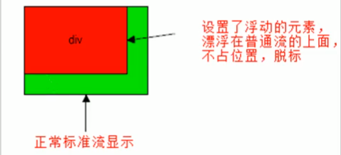

如果多个盒子都设置了浮动，则他们会按照属性值一行内显示并且顶端对齐排列。

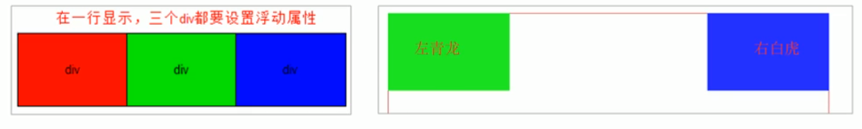

浮动元素时互相靠在一起的（无缝隙），如果父级宽度装不下这些浮动盒子，多出的盒子会另起一行对齐。

任何元素都可以浮动，不管原先是什么模式的元素，添加浮动之后具有行内块元素相似的特性。

所以，如果一个元素有了浮动，无论其为什么显示模式，都不需要转换模式。并且可以直接指定高度和宽度。

例如\<p>标签 给其添加浮动后且不指定宽度，那么当它右浮动时，宽度等于内容宽度。

由于\<p>标签有内置margin，所以浮动后会有上部没有对齐的情况，全局取消内外边距可以解决。

#### 7.4 浮动元素与标准流父级元素搭配

为了约束浮动元素的位置，网页布局一般采取的策略是：

先用标准流的父元素排列上下位置，之后内部子元素采取浮动排列左右位置，符合网页布局*第一准则*。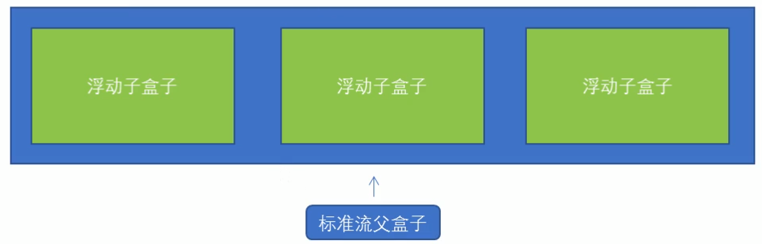

#### 7.5 常见的网页布局

第一种：

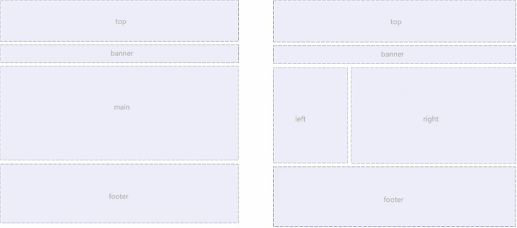

第三种：

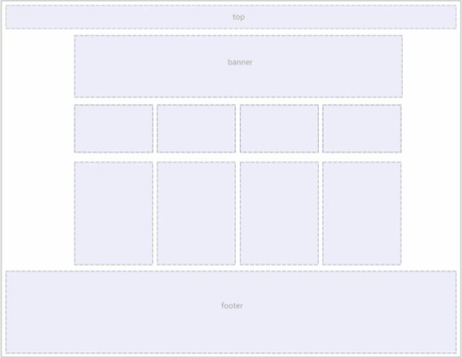

#### 7.6 浮动布局注意点

1. 浮动和标准流的父盒子搭配。

   先用标准流的父元素排列上下位置，之后内部子元素采取浮动排列左右位置。

2. 一个元素浮动了，理论上其余的同级元素也要浮动。

   一个大盒子中有多个小盒子 ，如果其中一个盒子浮动了，那么其他元素也应该浮动，防止出现问题。

   浮动的盒子只会影响浮动盒子后面的标准流，不会影响前面的标准流。

   当第一个盒子是标准流时会独占一行，第二个浮动盒子不会占据第一个盒子的位置，并且与第一个盒子的下边框对齐，第三个标准流盒子也会与第一个盒子下边框对齐。

#### 7.7 清除浮动

1. 为什么要清除浮动？

   由于父级盒子很多情况下不方便设置高度，但是盒子浮动又不占有父盒子位置，导致父盒子无法被撑开，最后父盒子高度为0时，就会影响下面的标准流盒子。

   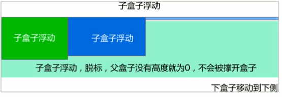

   * 由于浮动元素不再占有原标准流的位置，所以它会对后面的元素排版产生影响。

2. 清除浮动的本质
   * 清除浮动的本质就是清除浮动元素造成的影响
   * 如果父盒子本身有高度，则不需要清除浮动
   * 清除浮动后，父级就会根据浮动的子盒子自动检测高度。父级有了高度，就不会影响下面的标准流了

使用clear属性清除浮动。

```css
div {
    clear: both;
}
```

| 属性值 | 描述                                       |
| :----: | ------------------------------------------ |
|  left  | 不允许左侧有浮动元素（清除左侧浮动的影响） |
| right  | 不允许右侧有浮动元素（清除右侧浮动的影响） |
|  both  | 同时清除左右两侧浮动的影响                 |

清除浮动的策略：闭合浮动

3. 清除浮动的方法
   1. 额外标签法 也称为隔墙法，是w3c推荐的方法。
   2. 父元素添加overflow属性。
   3. 父级添加after伪元素。
   4. 父级添加双为元素。

**额外标签法**

额外标签法会在浮动元素末尾添加一个空的标签。例如

```html
<div style="clear: both">
</div>
```

或者其他标签，如\<br />等。

* 优点：通俗易懂，书写方便。
* 缺点：添加了无意义的标签，结构性较差。

注意：加入的标签的元素必须是块元素。

**父元素添加overflow属性**

可以给父级添加overflow属性，将其属性值设为hidden、auto或scroll。

```css
.box {
    /* 溢出隐藏 */
    overflow: hidden;
}
```

**after伪元素法**

:after方式是额外标签法的升级版。也是给父元素添加。

代码示例：

```css
.clearfix:after {
    content: "";
    display: block;
    height: 0;
    clear: both;
    visibility: hidden;
}
.clearfix {
    /* IE6, IE7专有 */
    *zoom: 1;
}
/* 此时给父元素添加clearfix类即可 */
```

* 优点：没有增加标签，结构简单清晰。
* 缺点：低版本浏览器兼容性有问题。

**双伪元素清除浮动**

代码示例：

```css
.clearfix:before,
.clearfix:after {
    content: "";
    display: table;
}
.clearfix:after {
    clear: both;
}
.clearfix {
    *zoom: 1;
}
/* 此时给父元素添加clearfix类即可 */
```

**清除浮动总结**
为什么要清除浮动？

1. 父级没高度。
2. 子盒子浮动。
3. 影响下面布局。

清除浮动四种方法对比

| 清除浮动方式          | 优点       | 缺点                         |
| --------------------- | ---------- | ---------------------------- |
| 额外标签法（隔墙法）  | 通俗易懂   | 添加了无意义的标签，结构性差 |
| 父级overflow: hidden; | 书写简单   | 溢出隐藏，内容可能会消失     |
| 父级after伪元素       | 结构语义化 | IE6-7不支持:after 兼容性问题 |
| 父级双伪元素          | 结构语义化 | IE6-7不支持:after 兼容性问题 |

### 附加

css属性书写顺序

建议遵循以下顺序：

1. 布局定位属性：display/position/float/clear/visibility/ovweflow （建议display第一个写，毕竟关系到模式）
2. 自身属性：width/height/margin/padding/border/background
3. 文本属性：color/font/text-decoration/text-align/vertical-align/white-space/break-word
4. 其他属性（CSS3)：content/cursor/border-radius/box-shadow/text-shadow/background:linear-gradient...

样本：

```css
.demo {
    display: block;
    position: relative;
    float: left;
    width: 100px;
    height: 100px;
    margin: 0 auto;
    padding: 20px 0;
    font-family: Arial;
    color: #fff;
    background: rgba(0,0,0,.5);
    border-radius: 10px;
}
```

**页面布局整体思路**

1. 确定页面的版心（可视区）。
2. 分析页面中的行模块，页模块。第一准则
3. 一行中的行模块使用浮动布局，先确定每个列的大小，然后确定列的位置。第二准则
4. 制作html结构，先有结构后有样式。

**导航栏注意点**
写导航栏时会使用li包含链接a的写法。

1. li+a语义清晰。
2. 如果直接使用a，搜索引擎容易辨别为有堆砌关键字嫌疑（故意堆砌关键字有被搜索引擎降权的风险，从而影响网站排名）

### CSS定位

#### 8.1 目标

* 为什么要用定位
* 定位的四个种类
* 四种定位的特点
* 为什么常用子绝父相布局
* 写出淘宝轮播图的布局
* 显示隐藏的两种方式及区别

1. 为什么需要定位

   某个元素可以自由在一个盒子内移动位置，并且压住其他盒子。

   定位是可以让盒子自由的在某个盒子内移动位置或者固定在屏幕中的某个位置，并且可以压住其他盒子

#### 8.2 定位的组成

定位：将盒子定在某一个位置，所以定位也是在摆放盒子，按照定位的方式移动盒子。

定位=定位模式+边偏移

定位模式用于指定一个元素在文档中的定位方式。边偏移则决定了该元素的最终位置。

1. 定位模式

   定位模式决定元素的定位方式，它通过CSS的position属性来设置，其值分为四个：

|    值    |   语义   |
| :------: | :------: |
|  static  | 静态定位 |
| relative | 相对定位 |
| absolute | 绝对定位 |
|  fixed   | 固定定位 |

2. 边偏移

   边偏移就是定位的盒子移动到最终的位置。有top bottom left right四个属性。

| 边偏移属性 | 示例          | 描述                                             |
| ---------- | ------------- | ------------------------------------------------ |
| top        | top: 80px;    | 顶端偏移量，定义元素相对于其父元素上边线的距离。 |
| bottom     | bottom: 80px; | 底部偏移量，定义元素相对于其父元素下边线的距离。 |
| left       | left: 80px;   | 左侧偏移量，定义元素相对于其父元素左边线的距离。 |
| right      | right: 80px;  | 右侧偏移量，定义元素相对于其父元素右边线的距离。 |

#### 8.3 静态定位（static）

静态定位是元素默认定位方式，无定位的意思。

语法:

```css
div {
    position: static;
}
```

* 静态定位按照标准流热性摆放位置，它没有边偏移。
* 静态定位很少用到。

#### 8.4 相对定位（relative）

相对定位是元素在移动的时候相对于它原来的位置来确定的。

```css
div {
    position: relative;
    top: 10px;
}
```

相对定位特点

1. 它是相对于自己原来的位置移动的（移动位置的时候参照点是自己原来的位置）。
2. 原来在标准流的位置继续占有，后面的盒子仍然以标准流的方式对待它。（不脱标，继续保留原来的位置。）

#### 8.5 绝对定位（absolute）

绝对定位是元素在移动位置时，相对于它祖先元素来确定的。

```css
div {
    position: absolute;
}
```

绝对定位特点：

1. 如果没有祖先元素或者祖先元素没有定位，则以浏览器为准进行定位。
2. 如果祖先元素有定位（相对、绝对、固定定位），则以最近一级有定位的祖先元素为参考点移动位置。
3. 绝对定位不再占有原先的位置。（脱标）

**子绝父相的由来**
子级元素是绝对定位的话，父级要用相对定位。

1. 子级绝对定位，不会占有位置，可以放到父盒子里面任何一个地方，不会影响其他同级盒子。

#### 8.6 固定定位（fixed）

固定定位是元素固定于浏览器可视区的位置。主要使用场景：可以在浏览器页面滚动时元素位置不变。

语法：

```css
div {
    position: fixed;
}
```

1. 以浏览器可视窗口为参照点移动元素。
2. 与父元素没有任何关系。
3. 不随着滚动条滚动。
4. 固定定位不占有原来的位置。

固定定位也是脱标的，其实固定定位也可以看作是一种特殊的绝对定位。

**固定在版心右侧位置**
算法：

1. 让固定定位的盒子left: 50%; 移动到可视区的一半位置。
2. 让固定定位的盒子margin-left：版心宽度一半的距离。

#### 8.7 粘滞定位（sticky）

粘性定位可以认为是相对定位和固定定位的结合。

```css
position: sticky;
```

粘滞定位的特点：

1. 以浏览器的可视窗口为参照移动元素（固定定位的特点）
2. 粘性定位占有原先的位置（相对定位的特点）
3. 必须添加任意一个边偏移才有效。

```css
div {
    position: sticky;
    top: 0;
    width: 1100px;
    height: 50px;
    background-color: pink;
    margin: 100px auto;
}
/* 当div随着滚动条到顶部时就不继续滚动 */
```

#### 8.8 总结

|     定位模式     |          是否脱标           | 移动位置                 | 使用频率 |
| :--------------: | :-------------------------: | ------------------------ | :------: |
| static 静态定位  |             否              | 不能使用边偏移           |   很少   |
| relative相对定位 |      否（占有原位置）       | 相对于自身（原位置）移动 |   常用   |
| absolute绝对定位 | 是（不占有原位置 类似浮动） | 带有定位的父级           |   常用   |
|  fixed固定定位   |      是（不占有位置）       | 浏览器可视区             |   常用   |
|  sticky粘滞定位  |       否（占有位置）        | 浏览器可视区             |   较少   |

#### 8.9 定位叠放顺序（z-index）

使用定位布局时，可能会出现，盒子重叠的情况。此时，可以使用z-index来控制盒子的前后顺序(z轴)。

```css
z-index: 1;
```

* 数值可以是正整数、负整数或0，默认是auto，数值越大，盒子越靠上。
* 如果属性值相同，则按照书写顺序，后来据上。
* 数字后无单位。
* 只有定位的盒子才有此属性。

#### 8.10 定位拓展

**绝对定位的盒子居中**
加了绝对定位的盒子不能通过margin: 0 auto;来水平居中，但是可以通过以下方法实现水平和垂直居中。

1. left: 50%; 让盒子的左侧移动到父级元素的水平中新的位置。
2. margin-left: -100px; 让盒子向左移动自身宽度的一半。

**定位的特殊特性**
绝对定位和固定定位也和浮动类似。

1. 行内元素添加绝对或者固定定位，可以直接设置高度和宽度。
2. 块级元素添加绝对或固定定位，如果不给宽度或高度，默认大小是内容大小。

**脱标的盒子不会触发外边距塌陷**

浮动元素、绝对定位、固定定位元素都不会触发外边距合并。

**绝对定位和固定定位会完全压住盒子**

浮动元素只会压住它下面的标准流盒子，但是不会压住下面标准流盒子里面的文字或图片。

绝对定位和固定定位则会压住下面标准流的所有内容。

> 浮动之所以不会压住文字，因为浮动最初的目的是做文字环绕效果（包含图片的文章）的。文字会围绕浮动元素。

### CSS高级技巧

#### 9.1 精灵图

1. 为什么需要精灵图

   一个网页中往往会应用很多小的背景图像进行装饰，当网页中的图像过多时，服务器就会频繁地接受和发送请求图片，造成服务器请求压力过大，这将大大降低页面的加载速度。

   因此，为了有效减少服务器接收和发送请求的次数，提高页面的加载速度，出现了CSS精灵图技术（也称CSS Sprites)。~~CSS雷碧~~

核心原理：将网页中的小背景图像整合到一张大图中，这样服务器只需请求一次就可以了。 

2. 精灵图的使用

   精灵技术主要针对背景图片使用，就是将多个背景图片整合到一张大图片中。

   这个大图片也称sprites精灵图

   移动背景图片的位置，从而得到想要的图片，此时可以使用background-position。

   移动的距离就是这个目标图片的x和y坐标。

   一般情况下都是向上或者向左移动，所以数值是负值。

   使用精灵图需要精确测量每个背景图片的大小和位置。

例

```css
background: url("images/sprites.png") no-repeat -180px 0;
```

#### 9.2 字体图标

字体图标使用场景：主要用于显示网页中通用、常用的一些小图标。

精灵图缺点：

1. 图片文件比较大。
2. 图片本身放大或缩小会失真。
3. 一旦图片制作完毕想要更换非常麻烦。

于是出现了字体图标iconfont(矢量图)

字体图标优点：

1. 轻量：一个字体图标比一系列的图像要小。一旦字体加载了，图标就会马上渲染，减少了服务器请求。
2. 灵活：本质是文字，可以随意更改颜色、添加阴影、透明效果、旋转等。
3. 兼容：几乎支持所有浏览器。

注：字体图标不能替代精灵技术，只是对图标部分技术的提升和优化。

总结：

如果遇到一些结构和样式比较简单的小图标就用字体图标。

**图标下载**

* icomoon字库：http://icomoon.io 

  icomoon简介：成立于2011年，推出了第一个自定义图标字体生成器，字库种类繁多，非常全面。

* 阿里iconfont字库：http://www.iconfont.cn 

  这是阿里巴巴M2UX的一个iconfont字体图标字库，包含了淘宝图标库和阿里图标库。可以使用AI制作图标上传生成，完全免费。

**字体图标引入**

1. 将下载包里面的fonts文件夹放到页面根目录下。

> 字体格式：
>
> 1. TureType(.ttf)格式 ttf字体是win和unix系统最常见的字体，支持这种字体的浏览器：IE9+ FIrefox3.5+ Chrome4+ Safari3+ opera11.1+
> 2. Web Open Font Format(.woff)格式字体，支持这种字体的浏览器有IE9+ Firefox3.5+ Chrome6+ Safari3.6+ Opera11.1+
> 3. Embedded Open Type(.eot)格式的字体是IE专用字体，支持这种字体有IE4+
> 4. SVG(.svg)格式字体是基于svg字体渲染的一种格式，支持这种字体的浏览器有Chrome4+ Safari3.1+ Opera10.0+

2. 在CSS样式中全局声明字体：简单理解把这些字体文件通过css引入到页面中。

```css
@font-face {
    font-family: 'icomoon';
    src: url('fonts/icomoon.eot');
    ...
}
/* 以上代码可在字体包里找到 */
```

3. html标签内添加小图标

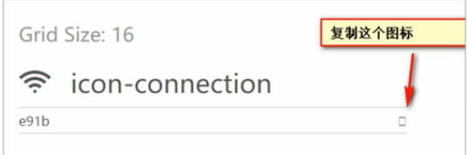

复制后添加到html标签内即可

**字体图标的追加**

当字体图标不够用时，我们可以向原来的字体文件中添加新的字体图标。

将压缩包内的**selection.json**重新上传，然后选择自己需要的新图标，重新下载压缩包并替换即可。

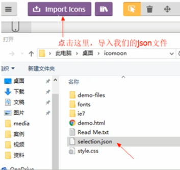

#### 9.3 三角形

网页中常见一些三角形，使用CSS直接就可以画出来，不必做成图片或者字体图标。

使用边框属性创建一个三角形

```css
width: 0;
height: 0;
border-top: 10px solid pink;
border-top: 10px solid red;
border-top: 10px solid blue;
border-top: 10px solid green;
```

会出现以下效果：

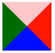

```css
border: 50px solid transparent;
border-top-color: pink;
/* 上三角形 */
```

>css三角形原理：
>1、通过只设置一个边框为有色，其余边框为透明色。
>2、三角形大小受非同向的两边框宽度影响。
>比如：下边框三角形，高度 = 下边框的宽度，宽度 = 左右边框宽度的和。
>
>

也可采用这种写法

```css
width: 0;
height: 0;
border-color: transparent red transparent transparent;
border-style: solid;
border-width: 22px 8px 0 0;
```

行内添加三角时可采用\<i>\</i>标签

#### 9.4 鼠标样式

```css
cursor: pointer;
```

| 值          | 作用          |
| ----------- | ------------- |
| default     | 白色箭头 默认 |
| pointer     | 小手          |
| move        | 移动          |
| text        | 文本          |
| not-allowed | 禁止          |

#### 9.5 表单轮廓线

例如input标签

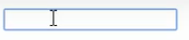

以上所示效果并不美观，可通过css 的outline属性就可以去掉默认的蓝色边框。

```css
outline: 0;
outline: none;
/* 去掉蓝色边框 */
```

#### 9.6 防拖拽文本域

文本域可拖拽大小，可通过css的resize属性防止用户拖拽文本域影响其他盒子摆放。

```css
textarea {
	resize: none;
}
```

**textarea标签尽量一行写，双标签分行会影响默认文本内容**

#### 9.7 行内元素和行内块元素的垂直居中

使用vertical-align属性设置图片、表单、文字的垂直对齐。

```css
vertical-align: baseline;
```

| 值       | 作用                                   |
| -------- | -------------------------------------- |
| baseline | 默认。元素放置在父元素的基线上。       |
| top      | 把元素的顶端与行中最高元素的顶端对齐。 |
| middle   | 此元素放置在父元素中部。               |
| bottom   | 把元素的顶端与行中最低的元素顶端对齐。 |

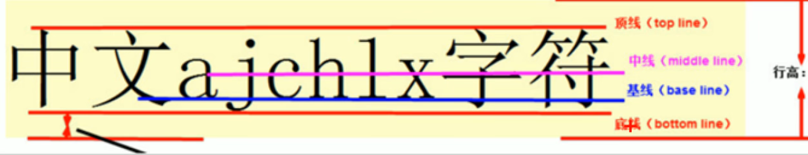

#### 9.8 图片底部默认空白缝隙问题

问题原因：行内块元素会和文字的基线对齐。

解决方法：

1. 给图片添加vertical-align: bottom / top / middle;
2. 把图片转换为块级元素：display: block; 块级元素没有vertical-align属性。

#### 9.9 溢出文字省略号显示

1. 单行文本溢出显示省略号--必须满足三个条件

   ```css
   /* 1. 先强制一行显示文本 */
   white-space: nowrap; /* （默认normal 自动换行） */
   /* 2. 溢出备份隐藏 */
   overflow: hidden;
   /* 3. 文字用省略号替代超出部分 */
   text-overflow: ellipsis;
   ```

2. 多行文本溢出显示省略号

   多行文本溢出显示省略号，有较大兼容性问题，适合于webkit浏览器或者移动端（移动端大部分是webkit内核）

   ```css
   overflow: hidden;
   text-overflow: ellipsis;
   /* 弹性伸缩盒子模型显示 */
   display: -webkit-box;
   /* 限制在一个块元素显示的文本行数 */
   -webkit-line-clamp: 2;
   /* 设置或检索伸缩盒子对象的子元素排列方式 */
   -webkit-box-orient: vertical;
   ```

可以不设置高度，让文字撑开盒子，溢出本分就隐藏了。

#### 9.10 常见布局技巧

1. margin负值的运用 

   相邻浮动的盒子边框会加粗，此时可以使用margin负值让相邻两个边框重合。

   此时设置悬停边框会有一侧被覆盖，这时提高当前盒子的层级即可(如果没有定位，则加相对定位，如果有定位则加z-index)

2. 文字围绕浮动元素

   运用浮动元素不会压住文字的特性。

3. 行内块元素运用

   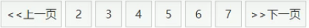

   做上图的页码效果时，可将每个页码的a标签转换成行内块元素，就会自动排列好。

#### 9.11 CSS初始化

不同浏览器对某些标签的默认值是不同的，为了消除不同浏览器对html文本呈现的差异，照顾浏览器的兼容，我们需要对CSS进行初始化

简单理解：CSS初始化是指重设浏览器样式。也称CSS RESET

每个网页都必须首先进行CSS初始化。

可以参考京东等大厂的初始化方法。

*css中文字体用相应的unicode编码代替，有效避免浏览器解释CSS代码时出现乱码问题。*
