## Django 入门

### 1. 安装Django

```
pip instal django
```

### 2. 创建项目

####  终端

* 打开终端

* 进入某个目录创建项目

* 执行

  ``` 
  django-admin startproject 项目名称
  ```

django项目中会有一些默认的文件和文件夹，稍后会对其解释

#### pycharm

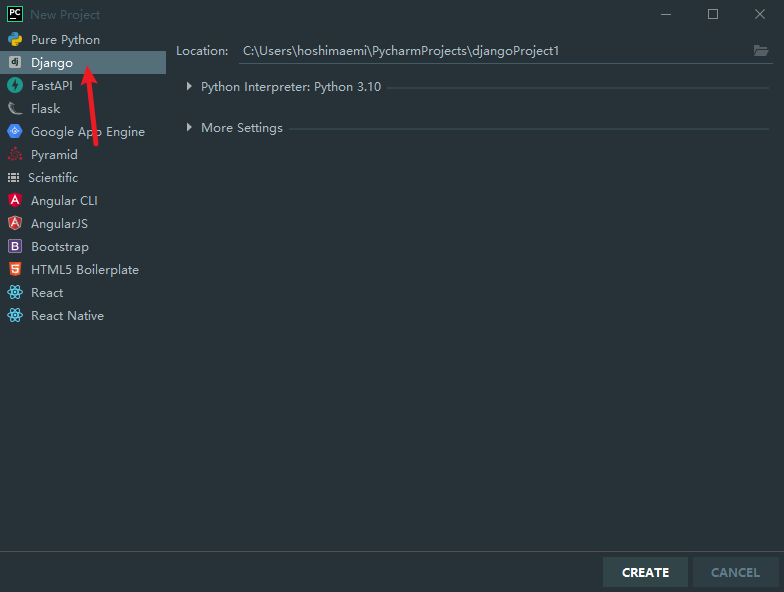

特殊说明：

* 通过命令行创建项目是标准的

* pycharm，在标准上加入了一点东西

  * 创建了一个templates目录

  * 添加了templates路径设置

    

    删除[]中内容

默认项目文件：

```
└─mysite
    │  manage.py 【项目的管理，启动项目，创建app，数据管理】
    │
    └─mysite
            settings.py 【项目配置】
            urls.py  【url和函数的对应关系】
            wsgi.py 【接受网络请求 同步】
            asgi.py  【接受网络请求 异步】
            __init__.py
```

### 3. APP

```
- 项目
	- app 【用户管理】【有独立的表结构、函数、html模板、样式表】
	- app 【订单管理】
	- app 【后台管理】【有独立的表结构、函数、html模板、样式表】
注意：平常开发用不到多个app， 一般只创建一个
```

创建app：

```
python manage.py startapp app名
```

app目录文件结构

```
app01
  │  admin.py   【默认提供的admin后台管理】
  │  apps.py   【固定，勿动】 【app启动入口】
  │  models.py  【对数据库
  │  tests.py  【单元测试，不懂动】
  │  views.py   【视图，url对应的函数写在里面】
  │  __init__.py
  │
  └─migrations 【不用动】 【数据库字段变更】
          __init__.py
```

#### 启动和运行Django

快速上手

* 确保app已注册

  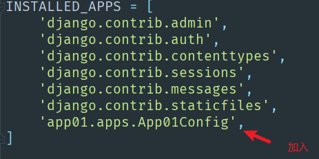

  * 编写URL和视图函数对应关系 导入views.py

    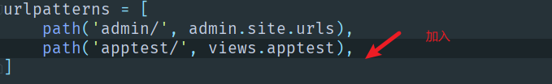

  * 启动django项目

    1. 命令行启动：

       ```
       python manage.py runserver
       ```

    2. pycharm启动

       

       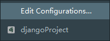
       
       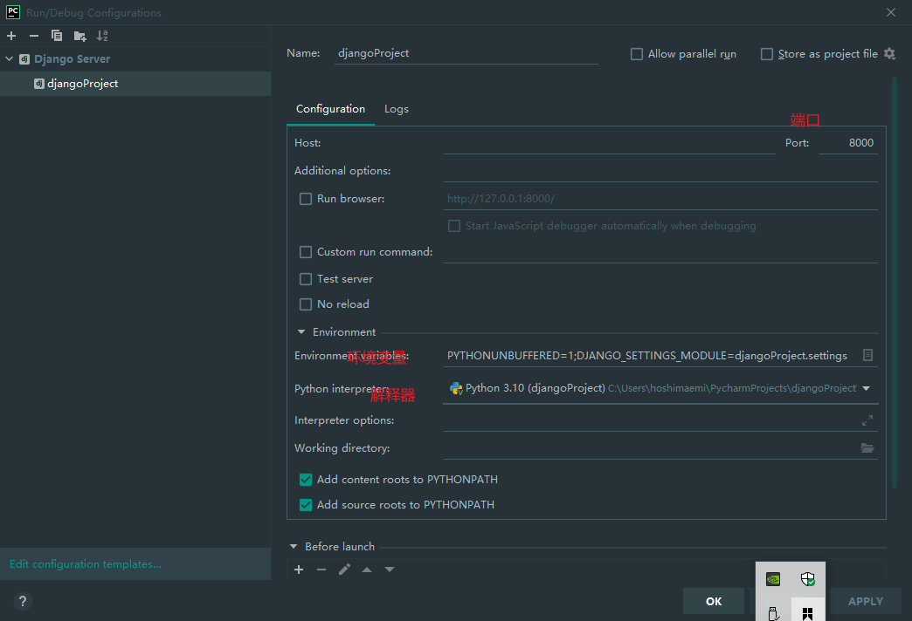
       
       配置后直接运行即可
       
        

### 4. 模板和静态文件

1. 写一个页面

   ```
   url -> 函数
   函数
   ```

   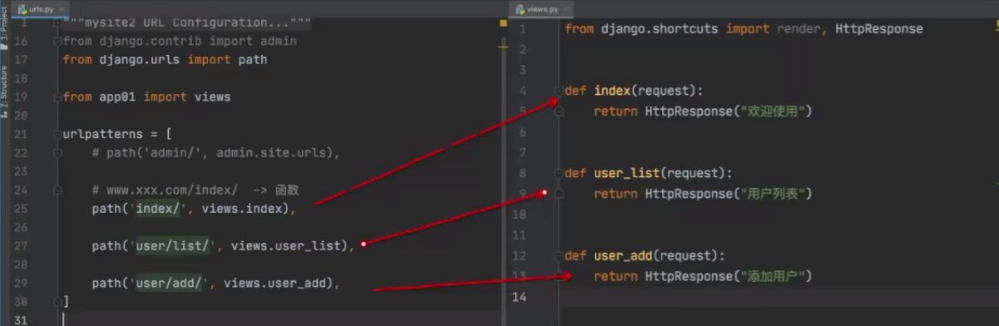

#### templates模板

```
# 去app目录下的templates目录寻找userlist.html (根据app的注册顺序)
# 如果settings.py文件中定义了templates dir则先在定义的目录里寻找，之后会去每个app里寻找（注册顺序）
return render(request, "user_list.html") # 返回user_list.html文件
```

#### 静态文件

开发中一般将：

* 图片
* css
* js

都会当作静态文件处理

在app目录下创建static目录，将以上类型文件放入

```html
  
```

static可创建以下目录结构，将文件分类放入

```
static
├─css       【放入样式表】
├─img       【放入图片】
├─js       【放入jquery等】
└─plugins  【放入bootstrap等】
```

django已经提供了static文件夹的引入方式，建议使用以下方式引用

```django

<!DOCTYPE html>
<html lang="en">
<head>
    <meta charset="UTF-8">
    <title>Title</title>
    <link rel="stylesheet" href=""
</head>
<body>
	
    <script src=""></script>
    <script src=""></script>
</body>
</html>
```

#### 模板语法

本质上：在html中写一些占位符，由数据对这些占位符进行替换

模板中python变量的引入

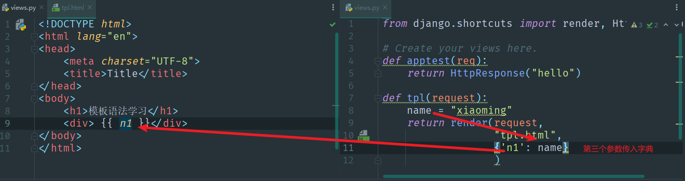

对于python 列表 字典等变量 直接引入可以将其完整显示出来 例如 ['111'] {"name": 111}

可迭代变量

1. 通过索引引入部分值 变量.索引值

   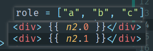

2. for循环遍历

   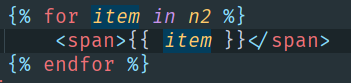

3. 字典建取值

   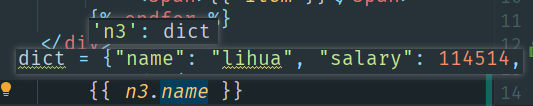

4. 字典遍历

   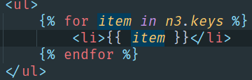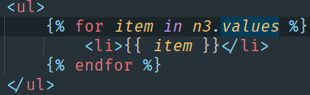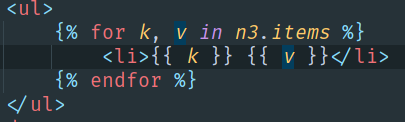

条件语句

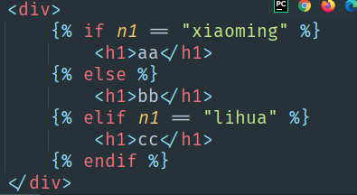

django数据显示大致原理

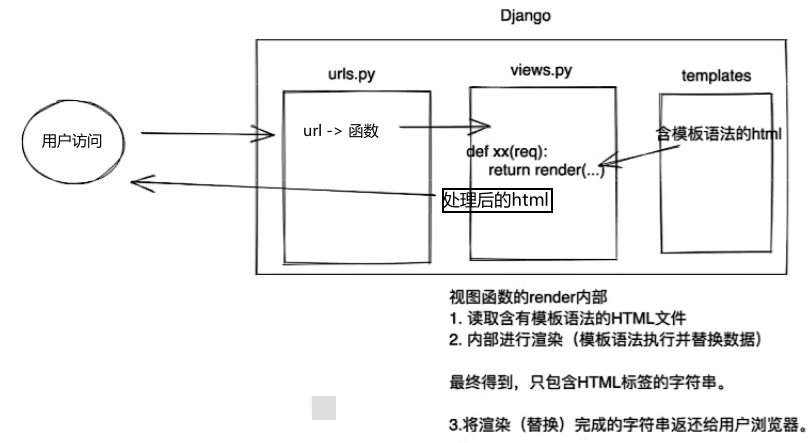

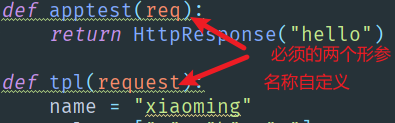

### 5. 请求和响应

获取用户请求

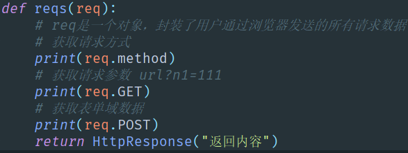

响应内容

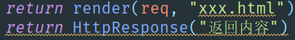

重定向

```python
return redirect("http://baidu.com") # 跳转到其他u
return redirect("/login/") # 跳转到对应url的login下
```

#### 用户登录案例

```python
# urls.py
path('login/', views.login)
# views.py
def login(request):
    if request.method == "GET":
        return render(request, 'login.html')
    else: # else可省略
        # 如果是post 获取数据
        user = request.POST.get("user")
        passwd = request.POST.get("passwd")
    	if user == "admin" and passwd == "123": 
        	# return HttpResponse("登录成功")
            retun redirect('http://bilibili.com')
        else: # 可省略
            # return HttpResponse("登录失败")
            return render(request, 'login.html', {"error_msg": "错误"})
```

```django
<form mtehod="POST" action="/login/">
    
    <input type="text" name="user" placehoder="用户名">
    <input type="password" name="passwd" placehoder="密码">
    <input type="submit" value="提交"> 
    <span style="color: red;">{{ error_msg }}</span>
</form>
```

django默认开启csrf token 验证中间件 确保数据安全

**模板没有传值则为空**

**action中的地址与访问地址相同时，可以省略不写**

### 6. 数据库操作

ORM（对象关系映射）

#### 安装第三方模块

```
pip install mysqlclient
```

orm可以帮助我们做两件事：

* 创建、修改、删除数据库中的表（无需写sql语句）。 【无法创建数据库】
* 操作表中的数据。【不用谢sql语句】

#### 手动创建数据库

* 启动mysql服务

  修改root密码

  更改鉴权方式

  ```sql
  us
  update user set plugin='mysql_native_password' where user ='root';
  flush privileges;
  ```

  更改密码

  ```sql
  ALTER user 'root'@'localhost' IDENTIFIED BY 'root';--修改密码为root
  ```

  开启远程链接

  ```sql
  update user set host='%' where user ='root';
  grant all on *.* to 'root'@'%';
  flush privileges;
  ```

* 创建数据库

  ```sql
  create database dbname DEFAULT CHARSET utf8 COLLATE utf8_general_ci;
  ```

* 连接数据库

在settings.py文件中配置

```python
DATABASES = {
    'default': {
        'ENGINE': 'django.db.backends.mysql',
        'NAME': 'django', # 新建数据库名
        'USER': 'root', # 数据库用户名
        'PASSWORD': 'mima', # 数据库密码
        'HOST': '127.0.0.1', # 数据库地址
        'PORT': '3306', # 端口
    }
}
```

#### 操作表

在models.py中创建表

```python
'''
创建一个app名_类名表
create table app01_userinfo(
	id bigint auto_increment primary key,
	name varchar(32),
	password varchar(64),
	age int)
'''
# 类必须继承models.Model
class UserInfo(models.Model):
    name = models.CharField(max_lenth=32)
    password = models.CharField(max_lenth=64)
    age = models.Integerfield() 
```

执行命令：

注：app一定要注册！！

```
python manage.py makemigrations
python manage.py migrate
```

查看数据库

```sql
use django;
show tables;
desc app01_userinfo;
select * from app01_department
```

修改表：

在表中新增列时，由于存在列中可能已有数据，所以新增列必须要指定默认值或者允许为空，那么你会出现以下问题

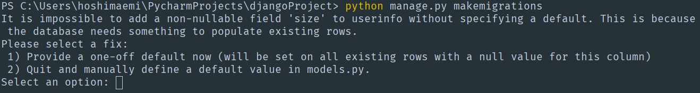

选择1可为新增的表添加默认值

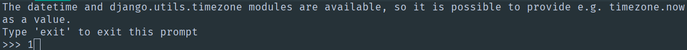

选择2可以采用以下方式添加默认值

```python
age = models.IntegerField(default=2)
```

或者允许为空

```python
data = models.IntegerField(null=True, blank=True)
```

再次执行迁移命令即可

#### 操作表中的数据

新建数据 insert into app01_name(title)values("ss")

```python
类名.objects.create(列="值", 列="值")
```

删除数据

```python
# 删除id=3的数据
类名.objects.filter(id=3).delete()
# 删除所有数据
类名.objects.all().delete()
```

获取数据返回列表 [行, 行] QuerySet类型 每一行都是对象

```python
data = 类名.objects.all()
for obj in data:
    print(obj.id, obj.name, obj.password)
data = 类名.objects.filter(id=1) # 依然是QuerySet
a = data.first() #取得一行数据
print(a.id, a.name)
```

修改数据

```python
# 修改所有密码为999
类名.objects.all().update(password=999)
# 修改部分数据
类名.objects.filter(name="lihua").update(password=99)
```

补：sql语句

删除表

```sql
drop table 表名;
```

保存emoji数据，转换编码

```sql
ALTER TABLE 你的表名 CONVERT TO CHARACTER SET utf8mb4 COLLATE utf8mb4_general_ci;
```

```python
# settings.py
DATABASES = {
    'default': {
        'ENGINE': 'django.db.backends.mysql',
        'HOST': '127.0.0.1',
        'PORT': '3306',
        'USER': 'root',
        'PASSWORD': '123456',
        'NAME': 'mysite',
        'OPTIONS': {'charset': 'utf8mb4'},
    }
 
}
```

