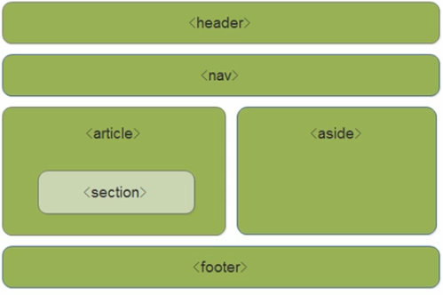
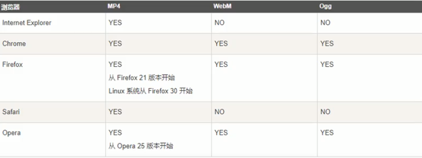
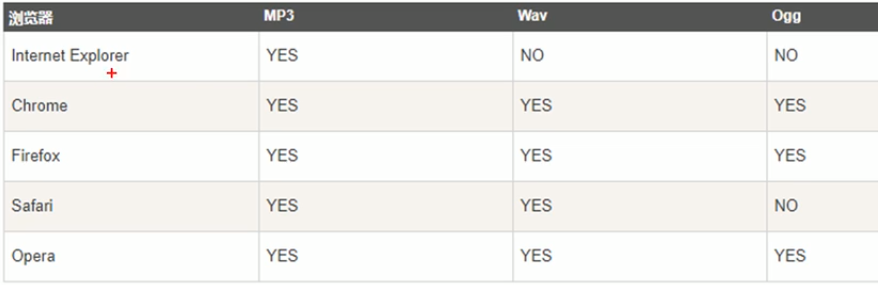

## HTML5和CSS3的提高

### 1. HTML5新特性

HTML5的新增特性主要是针对以前的不足，增加了一些新的标签、新的表单和新的表单属性等。

#### 1.1 HTML5新增的语义化标签

* \<header>: 头部标签
* \<nav>: 导航标签
* \<section>:文档某个区域
* \<article>: 文章标签
* \<aside>: 侧边栏标签
* \<footer>: 尾部标签

例如：



注意：

1. 这些语义化标准主要是针对搜索引擎的
2. 这些语义化标签可以使用多次
3. 在IE9中，需要将这些元素转为块级元素
4. 移动端更适合用这些标签

#### 1.2 HTML5新增的多媒体标签

新增的多媒体标签主要包含两个：

1. 音频：\<audio>
2. 视频：\<video>

使用它们可以很方便的在页面中嵌入视频和音频，而不在去使用flash和其他浏览器插件。

视频文件格式



语法：

```html
<video src="文件地址" controls="controls"></video>
```

兼容性语法

```html
<video width="320" height="240" controls>
	<source src="movie.mp4" type="video/mp4">
    <source src="movie.ogg" type="video/ogg">
    您的浏览器不支持video标签
</video>
```

常见属性

| 属性     | 值                                      | 描述                                                         |
| -------- | --------------------------------------- | ------------------------------------------------------------ |
| autoplay | autoplay                                | 视频就绪自动播放（谷歌浏览器需要添加muted来解决自动播放的问题） |
| controls | controls                                | 向用户显示播放控件                                           |
| width    | pixels（像素）                          | 设置播放器宽度                                               |
| height   | pixels（像素）                          | 设置浏览器高度                                               |
| loop     | loop                                    | 循环播放                                                     |
| preload  | auto（预先加载视频）none（不应加载视频) | 规定是否预加载视频（如果有autoplay则忽略该属性）             |
| src      | url                                     | 视频url地址                                                  |
| poster   | imgurl                                  | 加载等待的画面图                                             |
| muted    | muted                                   | 静音播放                                                     |

音频文件格式



语法

```html
<audio sec="文件地址" controls="controls"></audio>
```

兼容性语法

```html
<audio controls="controls">
	<source sec="a.mp3" type="audio/mpeg">
    <source src="a.ogg" type="audio/ogg">
    您的浏览器不支持audio标签
</audio>
```

| 属性     | 值       | 描述               |
| -------- | -------- | ------------------ |
| autoplay | autoplay | 音频就绪后自动播放 |
| controls | controls | 显示控件           |
| loop     | loop     | 循环播放           |
| src      | url      | 音频地址           |

* 谷歌禁止了视频和音频的自动播放

#### 1.3 HTML5新增的input类型

```html
<input type="email">
```

新增的type值

| 值     | 说明                       |
| ------ | -------------------------- |
| email  | 限制用户输入必须为电子邮件 |
| url    | 限制用户输入必须为URL      |
| date   | 限制用户输入必须为日期     |
| time   | 限制用户输入必须为时间     |
| month  | 限制用户输入必须为月份     |
| week   | 限制用户输入必须为周       |
| number | 限制用户输入必须为数字     |
| tel    | 手机号码                   |
| search | 搜索框                     |
| color  | 颜色选择表单               |

#### 1.4 HTML5新增的表单属性

| 属性         | 值        | 说明                                                         |
| ------------ | --------- | ------------------------------------------------------------ |
| required     | required  | 此项表单必填                                                 |
| placeholder  | 提示文本  | 表单的提示信息，默认为空                                     |
| autofocus    | autofocus | 自动聚焦属性，页面加载完自动聚焦到表单                       |
| autocomplete | off/on    | 当用户在字段开始输入时，浏览器显示之前输入过的值。默认打开on，需放在表单内同时加上name属性并且成功提交才会显示 |
| multiple     | multiple  | 可以多选文件提交                                             |

 ### 2. CSS3的新特性

#### 2.1 CSS3现状

* 新增的CSS3特性有兼容性问题，ie9+才支持
* 移动端支持优于PC端
* 主要学习：新增选择器、盒子模型及其他特性

新增选择器：

1. 属性选择器
2. 结构伪类选择器
3. 伪元素选择器

#### 2.2 属性选择器

属性选择器可以根据元素特定的属性来选择元素。这样就可以不用借助类或id选择器。

| 选择符        | 简介                                  |
| ------------- | ------------------------------------- |
| E[att]        | 选择具有att属性的 E 元素              |
| E[att="val"]  | 选择具有att属性且属性值等于val的E元素 |
| E[att^="val"] | 匹配具有att属性且值以val开头的E元素   |
| E[att$="val"] | 匹配具有att属性且以val结尾的E元素     |
| E[att*="val"] | 匹配具有att属性且值中含有val的E元素   |

与类选择器相同，权重为10

#### 2.3 结构伪类选择器

结构味伪类选择器主要根据文档结构来选择元素，常用于父级选择器里面的子元素。

| 选择符           | 简介                        |
| ---------------- | --------------------------- |
| E:first-child    | 匹配父元素的最后一个子元素E |
| E:last-child     | 匹配父元素最后一个E元素     |
| E:nth-child(n)   | 匹配父元素中第n个子元素E    |
| E:first-of-type  | 指定类型E的第一个           |
| E:last-of-type   | 指定类型E的最后一个         |
| E:nth-of-type(n) | 指定类型E的第n个            |

nth-child(n)选某个父元素的一个或多个特定的子元素

* n可以是数字，关键字和公式  
* n如果是数字，就是选择第n个子元素，里面数字从1开始
* n可以是关键字：evev偶数, odd奇数
* n可以是公式：常见的公式如下（如果n是公式，则从零开始计算，但是第0个元素或者超出了元素的个数会被忽略

```css
/* 从零开始 每次加一 */
ol li:nth-child(n) {
    background: pink;
}
```

常见公式

| 公式 | 取值               |
| ---- | ------------------ |
| 2n   | 偶数               |
| 2n+1 | 奇数               |
| 5n   | 5 10 15 ...        |
| n+5  | 从第五个开始到最后 |
| -n+5 | 前5个 包含第五个   |

**nth-of-type与nth-child区别**

nth-child会把所有的盒子都排列，只有满足指定序列且标签符合时才会被选中

例如：

```html
<section>
	<p>
        1
    </p>
    <div>
        2
    </div>
    <div>
        3
    </div>
</section>
```

```css
section div:nth-child(1){
    background-color: pink;
    /* 此时不会被选中 */
}
```

nth-of-type会把指定元素的盒子排列，选择时对应其序号

```css
section div:nth-of-type(1) {
    background-color: pink;
    /* 此时2被选中 */
}
```

**小结**

* 结构伪类选择器一般用于选择父级里面的第几个子元素
* nth-child对父元素里面的所有子元素排序选择（序号固定）先找到第n个子元素，然后判断其是否是对应元素
* nth-of-type对父元素里面指定的子元素进行排序选择，先匹配元素E，在根据序号选择第n个子元素
* 对于无需列表，更多使用nth-child
* 类选择器、属性选择器、伪类选择器，权重为10

#### 2.4 伪元素选择器

伪元素选择器可以帮助我们利用css创建新标签元素，而不需要html标签，从而简化html结构。

| 选择符   | 简介                     |
| -------- | ------------------------ |
| ::before | 在元素内部的前面插入内容 |
| ::after  | 在元素内部的后插入内容   |

注意：

* before和after创建一个元素，但是属于行内元素
* 新创建的这个元素在文档树中是找不到的，所以称为伪元素
* 语法：element::before {}
* before和after必须有content属性
* before在父元素内容前面创建元素，after在父元素后面插入元素
* 伪元素选择器和标签选择器一样，权重为1
