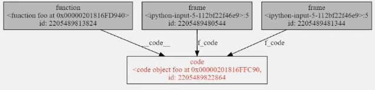
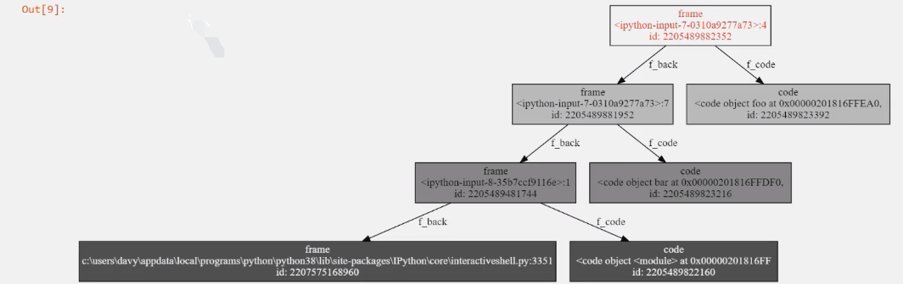
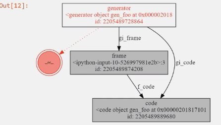
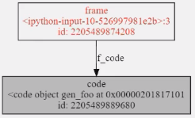
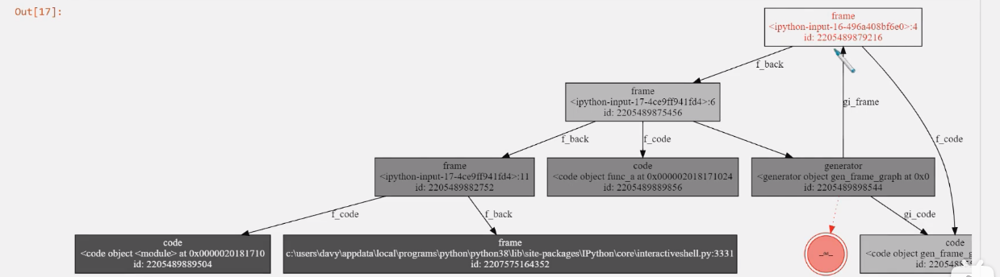
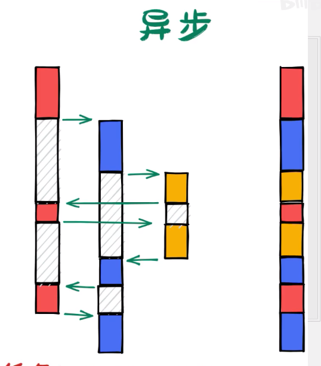

## python一些细节

开始此文档目的是对python的细节进行补充，内容和知识点比较零散，更新时间不定。

### 1.1 默认参数

已知如下代码

```python
class Player:
    def __init__(self, name, items):
        self.name = name
        self.items = items
```

情形1:

当我实例化两个玩家时

```python
p1 = Player("alice", [])
p2 = Player("Bob", [])
```

会发现大部分玩家默认都没有任何道具。

此时，想到python重载机制，利用默认参数进行重载。

既然大部分玩家默认没有道具，能否定义一个默认参数对每一个玩家进行初始化呢？

```python
class Player:
    def __init__(self, name, items=[]):
        self.name = name
        self.items = items
```

这样，在进行实例化时，无需传入一个默认的道具参数。

```python 
p1 = Player("alice")
p2 = Player("bob")
p3 = Player("Charles", ["sword"])
```

问题出现，当玩家获取了道具时

```python
p1.items.append("bow")
p2.items.append("sword")

# 问题
print(p1.items)
OUT: ["bow", "sword"]
```

当定义默认参数时，只会evaluate一次值，也就是只求一次值。意味着两次初始化items用的是同一个list。

list 为mutable，所以二者共用了一个list

```python
print(id(self.items))
# 两次输出的id相同
```

解决方法: 将``items=[]``改为``items=None``

```python
class Player:
    def __init__(self, name, items=None):
        self.name = name
        if items is None:
        	self.items = []
        else:
            self.items = items
```

### 1.2 浮点数

如下代码:

```python
from objprint import op
op.config(arg_name=True)

op(0.1+0.2==0.3)
op(1e50==10**50)
op(1e500==1e600)
op(1e500>10**1000)
op(1e500*1e500>0)
op(1e500/1e500>0)
op(1e500/1e500==1e500/1e500)
```

输出

```
0.1+0.2==0.3:
False
1e50==10**50:
False
1e500==1e600:
True
1e500>10**1000:
True
1e500*1e500>0:
True
1e500/1e500>0:
False
1e500/1e500==1e500/1e500:
False
```

[关于浮点数的知识](http://zh.wikipedia.org/wiki/IEEE754)

计算机实现浮点数都使用IEEE754标准，由于浮点数的总体是无限且不可数的，我们不可能在计算机中完整地记录所有数字。

> IEEE754标准提供了二进制转浮点数的标准 具体内容[IEEE754](http://zh.wikipedia.org/wiki/IEEE754)

从而就产生了以上问题

问题1: 精度损失

```python
op(0.1+0.2==0.3)
0.1+0.2==0.3:
False
# python 中 1e50会被转为float而10**50会被当成一个big integer
# python中，整型是绝对精确的，浮点数不是。
# 故浮点数比较不应该使用==。而是比较两个数差值的绝对值是否小于一个比较小的值 0.00001
op(1e50==10**50)
1e50==10**50:
False
```

问题2: 

python使用64位双精度浮点数，其有最大的能表示的浮点数，对于双精度浮点数来说，这个数大概是10的308次方。

超出了这个数字：IEEE754提供了无穷( Inf )和非数值( NaN )两种表示形式。

```python
# 1e500超过了双精度浮点数最大能表示的范围，python将其转换成了Inf,1e600同理。
# 所以以下代码比较的是Inf 是否等于 Inf 详见IEEE754。
op(1e500==1e600)
1e500==1e600:
True
# 比较方式 -Inf = -Inf, Inf=Inf, NaN与任何浮点数（包括自身）的比较都为假。
# python在比较如下代码时如果这个float是Inf，则认为永远比integer要大。
op(1e500>10**1000)
1e500>10**1000:
True
# 既然如此 以下各数都是+Inf 正无穷乘以正无穷一定是大于0的。
# 但正无穷除以正无穷可能是大于等于零的任何值。
# 所以 Inf / Inf = NaN 不是数字 NaN当然不大于零。
op(1e500*1e500>0)
op(1e500/1e500>0)
1e500*1e500>0:
True
1e500/1e500>0:
False
# 左边是NaN右边也是NaN, 他们也不相等
op(1e500/1e500==1e500/1e500)
1e500/1e500==1e500/1e500:
False
```

综上，float可能会给程序带来意想不到的结果。

例如，在一些大型的数学计算中，中间的某一个过程出现了Inf或是NaN，他会随着计算将各种结果传染成Inf或NaN。

而且，程序不会报错，你无法意识到问题所在。

所以，要尽量避开浮点数。

如果不可避免，可使用以下方式检查关键步骤是否为Inf或NaN。

```python
import math
math.isinf(Var)
math.isnan(Var)
```

### 1.3 class里的函数如何变成方法的(self作用)

```python
class A:
    def f(self, data): # <-定义了两个位置参数
        print(data)
o = A()
o.f("hello") # <- 实际传入了一个 
# self保存了本身的对象
```

在定义class时会创建一个命名空间，运行class里的code block,将里面的产生的local variable赋值到``__dict__()``里面。

为什么只需要传入一个位置参数呢

```python
class A:
    def f(self, data): # <-定义了两个位置参数
        print(self.name)
        print(data)
o = A()

print(A.f)
# 只有实例化之后才只需传入一个值
print(o.f)
返回：
<function A.f at 0x7f7444387eb0>
<bound method A.f of <__main__.A object at 0x7f74443957e0>>
```

```python
class A:
    def f(self, data):
        print(data)
        print(self.name)
        
o = A()
o.name = "sam"

myfunc = o.f  # o.f实际上返回绑定在o本身上的一个方法 调用时不需要传入self
# 可以理解 f 在实例化时就已经改变，并不是最初定义的f
myfunc("hello")
返回
hello
sam
```

### 1.4 鸭子类型

>“当看到一只鸟走起来像鸭子、游泳起来像鸭子、叫起来也像鸭子，那么这只鸟就可以被称为鸭子。”

鸭子类型是动态类型的一种风格，在这个风格中一个对象有效的语义，不是由继承自特定的类或实现特定的接口，而是由“当前方法和属性的集合”决定

例如：

```python
# 可迭代对象
a = [11, 22, 33]
# 我们可以使用 for 循环来遍历他
for i in a:
    print(i)
# 现有自定义类
class B:
    pass
# 使用 for 循环必然会报错 此时 可以为类 B 添加一个 __iter__()方法
class B:
    def __iter__(self):
        return iter([1, 2, 3])
# 同理 我们可以使用len()函数来查看一个对象的长度
len(a)
# 如何使类B也能使用len函数查看长度呢
class B:
    def __len__(self):
        return 10
```

总结 python不会检查某个类是什么类型，他只会检查是否含有对应方法。

### 1.5 assert 关键字

assert 意为断言 当 后面的表达式为假时抛出__AssertionError__

例如

```python
x = "hello"

# 如果条件返回True，则什么也不会发生：
assert x == "hello"

#如果条件返回 False，则会引发 AssertionError：
assert x == "goodbye"
```

### 1.6 找到可迭代对象共同的接口

#### 常见的可迭代对象

```python
iterables = [
    "123",          # 字符串
    [1, 2, 3],      # 列表
    (1, 2, 3,),     # 元组
    {1:"a", 2:"b"}, # 字典
    {1, 2, 3}       # 集合
]
for iterable in iterables:
    print(type(iterable))
    for x in iterable:
        print(x, end='')
    print()
```


利用python 强大的类型能力

```python
def common_attrs(*objs):
    """计算对象之间的共同属性"""
    assert len(objs) > 0
    attrs = set(dir(objs[0]))
	for obj in objs[1:]:
        attrs &= set(dir(obj)) # 取交集
    attrs -= set(dir(object)) # 删除object 基础对象属性
    return attrs
iterable_common_attrs = common_attrs(*iterables)
print(iterable_common_attrs)
```

返回三个结果

```
__contains__ __len__ __iter__
```

这里列举的对象都是容器类型的可迭代对象

加入文件

```python
f = open("...", "r") # 文件也是可迭代对象
# 加入到可迭代对象清单中
iterables.append(f)
iterable_common_attrs &= set(dir(f))
print(iterable_common_attrs)
```

返回

```
__iter__
```

对于双下划线的魔法方法 `__iter__()`，对应的调用方法就是内置函数iter()

对所有的可迭代对象调用`iter()`方法

```python
for iterable in iterables:
    print(iter(iterable))
```

```
<str_iterator object at 0x7f07f2c3c700>
<list_iterator object at 0x7f07f2c3c700>
<tuple_iterator object at 0x7f07f2c3c700>
<dict_keyiterator object at 0x7f07f2a520c0>
<set_iterator object at 0x7f07f2a56640>
<_io.TextIOWrapper name='test.ui' mode='r' encoding='UTF-8'>
```

此外 由可迭代对象列表得到相应的迭代器列表

```python
iterators = [iter(iterable) for iterable in iterables]
iterator_common_attrs = common_attrs(*iterators)
print(iterator_common_attrs)
```

```
{'__next__', '__iter__'}
```

所以 迭代器有两个共同接口 `__iter__` 和 `__next__` 迭代器也是一个可迭代对象

#### 关于next魔法方法


至此 我们了解到迭代的三个步骤：

* 调用 `iter(iterable)`来构建迭代器
* （多次）调用`next(iterator)`来获取值
* 最后捕获`StopIteration`异常来判断迭代结束

现在 我们可以使用`while循环`来模拟`for循环`迭代

```python
# 创建迭代器
iterator = iter(actions) # 对应可迭代对象的 __iter__ 方法
while 1:
    try:
        # 通过迭代器获取下一个对象
        print(next(iterator)) # 对应迭代器的 __next__ 方法
        except StopIteration:
            # 迭代结束 跳出循环
            break
```

迭代器的`__iter__`方法作用是什么呢？

#### 了解如何定义一个迭代器

迭代器的基本功能：

* 初始化时要传入可迭代对象，这样才能知道去哪里取数据
* 要初始化迭代进度
* 每次迭代调用`__iter__()`方法时：
  * 如果仍有元素可以迭代，则返回本轮迭代的元素，同时更新当前迭代进度
    * 如果无元素可以迭代，则迭代结束，抛出`StopIteration`异常

看起来没什么作用，所以我们可以给迭代器添加额外的功能

* 设置一个黑名单，如果当前元素在黑名单内，则跳过
* 将某些符合条件的数据`*2`后返回

```python
BLACK_LIST = ["白嫖"，"取关"]

class SuzhiIterator:
    def __init__(self, actions):
        self.actions = actions
        self.index = 0

    def __next__(self):
        while self.index < len(self.actions):
            action = self.actions[self.index]
            self.index += 1
            if action in BLACK_LIST:
                continue
            elif '硬币' in action:
                return action * 2
            else:
                return action
        raise StopIteration

actions = ['点赞','投币','取关']
sz_iterator = SuzhiIterator(actions)
while True:
    try:
        print(next(sz_iterator))
    except StopIteration:
        break
```

以上代码运行起来沒什么问题

但当我们使用`for 循环`来遍历时 会报错

```python
# for 循环需要的是 可迭代对象 而不是迭代器
for x in SuzhiIterator(actions):
    print(x)
    
TypeError: 'SuzhiIterator' object is not iterable
```

要想这个对象是`iterable` 那么你需要实现`__iter__`接口

为了构建这个可迭代对象 可以再新建一个类

```python
class SuzhiActions:
    def __init__(self, actions):
        self.actions = actions
    def __iter__(self):
        return SuzhiIterator(self.actions)
for x in SuzhiActions(actions):
    print(x)
```

当然 这样做 显然有点多余 因为他只完成了构建可迭代对象的过程

通常这样 让迭代器自己来实现`__iter__`接口

```python
...# __iter__ 接口就是要返回一个迭代器
def __iter__(self):
    return self
```

现在 迭代器就可以在`for 循环`中使用了

```python
# 迭代器 同时 也是 可迭代对象
```

#### 迭代器协议

在python文档中明确指出了，迭代器对象必须同时实现`__next__`和`__iter__`两个方法，这称为**迭代器协议**。

根据这个协议，迭代器**必须**是可迭代的，换言之，**迭代器 是一种 可迭代对象 **。

故缺少了`__iter__`方法的迭代器是不完整的，不符合迭代器协议的要求。

所有迭代器的`__iter__`方法大多数都只要`return self`即可。

#### 迭代器的意义

浅层的意义

* 统一通过`next()`方法获取数据，可以屏蔽底层不同的数据读取方式，从而简化编程。
* 容器类的数据结构只关心数据的金泰存储，每一次迭代都需要额外的迭代器对象专门负责记录迭代过程中的状态信息。

按照这个思路 很容易形成这样的认知：迭代器就是为了让数据能够更快捷地遍历 从而定义的辅助对象

```
这一些迭代对象对我们来说非常陌生，不会去使用他们，所以这种认知在这个层面上来讲，是没有错误的。
<str_iterator object at 0x7f07f2c3c700>
<list_iterator object at 0x7f07f2c3c700>
<tuple_iterator object at 0x7f07f2c3c700>
<dict_keyiterator object at 0x7f07f2a520c0>
<set_iterator object at 0x7f07f2a56640>
<_io.TextIOWrapper name='test.ui' mode='r' encoding='UTF-8'>
```

迭代器的作用并不止于此。

如果只是在`for 循环`中使用，是无需用到迭代器的`__iter__`方法的，就像前面使用`while循环`来模拟`for循环`。

深层意义

迭代器的`__iter__`方法是点睛之笔！

对此，我们分一下类

现在有两种可迭代对象

* 容器类型的
  * 列表、元组、字典等
  * 只有`__iter__`接口
  * 静态的数据
  * 需要额外的迭代器支持
  * 支持多次迭代

* 迭代器类型
  * 文件、 StringIO等
  * 同时实现`__iter__`和`__next__`接口
  * 动态的
  * 只能迭代一次

也就是说

```python 
# 针对容器类型可迭代对象的循环
for x in iterable: # 背后： 将可迭代对象 生成了 迭代器
    pass # 迭代器的生命周期和此循环绑定在一起
```

而一旦迭代器实现了`__iter__`方法

首先迭代器的构建就脱离的这个循环的存在，整个迭代过程只需要迭代器就够了

从此 迭代器不光是从后台走向了前台，而且直接让可迭代对象原理了循环

迭代器的构建是在代码中单独完成的，和当前循环操作**解耦**了

于是：

* 一个可迭代对象可以构建出任意多个不同的迭代器
* 一种迭代器可以应用有v任意多个可迭代对象（包括其他迭代器）

#### 应用场景

1. 构建一个数据管道

如果迭代器不可迭代：

三者关系如下

 [for循环] <- 迭代器（隐藏） <- 可迭代对象

如果迭代器可以任意嵌套连接的：

for 循环 <- 迭代器 <-迭代器 <- 迭代器 <- 迭代器*n <- 可迭代对象

* 很多的迭代器串联起来，形成一个处理数据v的管道，或者称为数据流
* 在这个管道中，每一次只通过一份数据v,避免了一次性加载所有数据
* 迭代器也不仅仅只是按返回数据那么简单了，他开始承担处理数据的责任
  * 例如， `SuzhiIterator`实现了部分过滤器和放大器的功能

* 当通过迭代器获取数据的时候，远离了数据存储，渐渐开始不关心数据如何存储。

2. 数据生成器

```python
from random import random

class Random:
    def __iter__(self):
        return self
    def __next__(self):
        return random()
```

这个迭代器不但不需要存储数据，甚至连`StopIteration`都不需要捕获

它可以无穷地迭代下去，每次数据都是实时产生的，不占用内存

（这不就是生成器吗！——）

虽然该迭代器是名副其实的数据生成器，但是生成器在python 中特指包含`yield` 的函数对象，以后会记录。

附:没有定义`__iter__`的可迭代对象

并不是所有的可迭代对象都必须定义`__iter__`方法

如果一个对象没有`__iter__`方法，但是定义了`__getitem__`方法，同样是可迭代的。

```python
# 例如 
class DumbList:
    def __getitem__(self, index):
        if index > 5:
            raise StopIteration
        return index * 2
dl = DumbList()
for x in dl:
    print(x)
```

因此，不能通过检查存在`__iter__` 方法来判断一个对象是否为可迭代的，而是应该直接使用`iter()`函数，如果不可迭代，则会抛出`TypeError`异常。

```python
class NotIterable:
    pass
ni = NotIterable()
it = iter(ni)
```

### 1.7 生成器

#### 1.yield关键字

* 只能用在函数内。
* 在函数的任何地方出现了`yield`关键字，哪怕永远无法被执行，函数都会发生变化。

这个变化就是当你以正常方式调用函数时，返回一个` 生成器`对象，此时函数还没有运行。

```python
def gen():
    print("hello")
    if 0:
        yield
g = gen()
print(g)
# <generator object at 0x0000...>
# 未打印hello
```

#### 2.术语相关

通常我们把含有`yield`关键字的函数称为 生成器函数 generator function ，把调用生成器函数返回的结果称为 生成器。

但在python文档中：

> 生成器 通常指的是生成器函数，但是在一定语境下也可以指代生成器迭代器 `generator iterator` ，为了避免歧义，推荐使用完整的术语。

既然叫做迭代器，那么我们可以理解 生成器对象就是一个迭代器。

从而满足 迭代器协议：

* `__iter__`返回迭代器对象本身
* `__next__`返回一个迭代数据，如果没有数据，抛出`StopIteration`异常

#### 3.深入理解yield关键字

##### 语句or表达式

* yield 语句
  * PEP252 -- Simple Generator
  * Python 2.2

* yield 表达式
  * PEP342 -- Coroutines via Enhanced Generators
  * Python 2.5

##### yield 对函数做了什么

` yield`关键字最根本作用是改变了函数的性质：

1. 调用生成器函数并不是直接执行其中的代码，而是返回一个对象。
2. 生成器函数内的代码，需要通过生成器对象来执行。

从这一点，生成器函数的作用和 `类(class)`类似。

生成器对象就是迭代器，所以其运行方式和迭代器是一致的：

* 通过`next()` 函数来调用
* 每次`next()` 都会遇到`yield`后返回的结果（作为`next()`的返回值）
* 如果函数运行结束（即遇到`return`或代码执行完毕）则抛出`StopIteration`异常

示例

```python
# 定义一个生成器函数
def gen(a):
    print("hello")
    if a:
        print("yield")
        yield 666
        print("back")
    print("bye")
    return "result"
g1 = gen(False) # 不执行yield
x = next(g1)
'''
hello
bye
Traceback (most recent call last):
  File "D:\a.py", line 10, in <module>
    x = next(g1)
StopIteration: result
return 的结果也会被异常带出函数
'''
g2 = gen(True)
y = next(g2)
print(y)
'''
hello
yield
666
'''
next(g2)
'''
back
bye
Traceback (most recent call last):
  File "D:\a.py", line 10, in <module>
    next(g2)
StopIteration: result
'''
```

##### 在循环中使用 yield

只遇到一次`yield`语句的生成器就是只能迭代一次的迭代器，通常没什么价值

要想多迭代几次，可以在函数内多次使用`yield`语句：

```python
def gen():
    yield 1
    yield 2
    yield 3
    yield 4
```

相对应的，`yield` 也可以搭配循环使用：

```python
# iterator count
def count(start=0, step=1):
    # count(10) -> 10 11 12...
    # count(2.5, 0.5) -> 2.5 3.0 3.5 ...
    n = start 
    while True:
        yield n
        n += step
```

##### 生成的四个状态

* 当调用生成器函数得到生成器对象时
  * 此时的生成对象可以理解为**初始**状态
* 通过`next()` 调用生成器对象，对应的生成器函数代码开始运行
  * 此时生成器对象处于**运行中**状态
* 遇到`yield`语句，`next()`返回时
  * `yield`语句右边的对象作为`next()`的返回值
  * 生成器在`yield`语句所在的位置**暂停**，当再次使用`next()`时继续在改位置运行
* 如果执行到函数结束，则抛出`StopIteration`异常
  * 无论是使用了`return`语句显式地返回值，或者默认返回`None`值，返回值都只能作为异常的值一并抛出
  * 此时生成器对象处于**结束**状态
  * 对于已经结束的生成器对象再次调用`next()`，直接抛出`StopIteration`异常，并且不包含返回值

##### 使用yield重构迭代器

与`class`定义迭代器对比

| 动作           | class实现的迭代器                           | yield生成器          |
| -------------- | ------------------------------------------- | -------------------- |
| 定义迭代器     | class Iterator: def \__init__(self, *args): | def iter(*args): ... |
| 构建迭代器     | Iterator(args)                              | iter(args)           |
| next(iterator) | def \__next__(self): return values          | yield value          |
| StopIteration  | raise StopIteration                         | return               |
| iter(iterator) | def \__iter__(self): return self            | 自动实现             |

生成器的三种应用场景：

* 定义一个容器类的对象，为该对象实现`__iter__`接口
* 定义一个处理其他可迭代对象的迭代器
* 定义一个不依赖数据存储的数据生成器

为数据列实现`__iter__()`接口

```python
# 迭代器类
class CustIter:
    def __init__(self, data):
        self.data = data
        self.index = 1
    def __iter__(self):
        return self
    def __next__(self):
        self.index = 1
        if self.index < self.data.size:
            return self.data.get_value(self.index)
        else:
            raise StopIteration
# 可迭代数据类
class CustData:
    # 其余部分代码不重要 略
    ...
    @property
    def size(self): # 假设可以得到数据的大小
        return self.size
    def get_value(self, index):
        return index
    def __iter__(self):
        return CustIter(self)
```

yield 重构

```python
# 删除CustIter类
class CustData:
    # 其余部分代码不重要 略
    ...
    @property
    def size(self): # 假设可以得到数据的大小
        return self.size
    def get_value(self, index):
        return index
    def __iter__(self):
        index = -1      # 必须是局部变量
        while index < 2: # 设置迭代完成的条件
            index += 1
            yield self.get_value(index)
 mydata = CustData() # 注  mydata 是可迭代对象，但不是迭代器
```

实现有处理数据功能的迭代器

```python
BLACK_LIST = ["1", "2"]
class DataFilter:
    def __init__(self, actions):
        self.actions = actions
        self.index = 0
    def __next__(self):
        while self.index < len(self.actions):
            action = self.actions[self.index]
            self.index += 1
            if action in BLACK_LIST:
                continue
            elif "3" in action:
                return action * 2
            else:
                return action
        raise StopIteration
    def __iter__(self):
        return self
```

yield重构

```python
BLACK_LIST = ["1", "2"]
def filt(actions):
    for action in actions:
        if action in BLACK_LIST:
            continue
        elif "3" in action:
            yield action * 2
        else:
            yield action
actions = ["1", "3", "4"]
for x in filt(actions):
    print(x)
```

实现一个数据生成器

计数器实现

```python
class Count:
    def __init__(self, start):
        self.start = start
    def __iter__(self):
        return self
    def __next__(self):
        if self.start > 0:
            start -= 1
            return self.start
        else:
            raise StopIteration()
```

yield重构

```python
def count(start):
    while start > 0:
        start -= 1
        yield start
for x in count(5):
    print(x)
```

##### (重要) 生成器技术实现

主要内容

* 生成器函数和普通函数的区别
* 生成器对象和生成器函数之间的关系
* 生成器函数可以*暂停*执行的秘密

**普通函数的运行机制**

函数对象和代码对象

每当定义了一个函数之后，就得到了一个 函数对象：

```python
def func():
    ...
print(func)
# <function __main__.func()>
```

函数中的代码是保存在 **代码对象 Code Object** 中的：

```python
print(func.__code__)
# <code object func at 0x..., file "<...>", line 1>
```

代码对象会随着函数对象一起创建，是函数对象的一个重要属性。

> Code objects represent byte-compiled executable Python code, or byte code

代码对象中重要的属性以`co_`开头：

```python
func_code = func.__code__
for attr in dir(func_code):
    if attr.starstwith("co_"):
        print(f"{attr}\t: {getattr(func_code, attr)}")
'''
co_argcount     : 0
co_cellvars     : ()
co_code : b'd\x00S\x00'
co_consts       : (None,)
co_filename     : <ipython-input-1-4152f59160a0>
co_firstlineno  : 1
co_flags        : 67
co_freevars     : ()
co_kwonlyargcount       : 0
co_lines        : <built-in method co_lines of code object at 0x000001F0961F68C0>
co_linetable    : b'\x04\x01'
co_lnotab       : b'\x00\x01'
co_name : func
co_names        : ()
co_nlocals      : 0
co_posonlyargcount      : 0
co_stacksize    : 1
co_varnames     : ()
'''
```

**函数运行帧**

函数对象和代码对象保存了函数的基本信息，当函数运行时，还需要一个对象来保存运行状态。

这个对象就是**帧对象（Frame Object）**

> Frame objects represent execution frames.

每次调用一个函数，都会创建帧对象，来记录每次运行的状态。

使用`inspect`检查帧对象

```python
import inspect

def foo():
    # 获取到函数的运行帧并返回
    # 通常情况下 函数运行帧 在函数运行结束后会被立即销毁
    return inspect.currentframe()
f1 = foo() # 但由于变量被引用，所以帧不会被垃圾回收
print(f1)
# <frame at 0x..., file '...', line 5, code foo>
```

```python
# jupyter 运行此代码 导入 import objgraph
# 再调用一次，获取另一个帧
f2 = foo()

# 函数对象、代码对象和帧对象之间的关系
objgraph.show_backrefs(foo.__code__)
```



可见 `function` 和 `frame`对象均有对`code`的引用。

帧对象中重要的属性以`f_`开头：

* `f_code`：执行的代码对象
* `f_back`: 指向上一个帧，也就是调用者的帧
* `f_locals`: 局部变量
* `f_globals`: 全局变量
* `f_lineno` ：当前对应的行号

**函数运行栈**

当一个函数调用了另一个函数，此时前一个函数还没有结束，所以这两个函数的帧对象是同时存在的。

比如，我们的程序一般始于一个`main`函数，然后又调用其他函数，以此类推。

因此，一个程序的运行期，同时存在很多个帧对象。

函数之间的调用关系是**先执行的后退出**，所以帧对象之间的关系也是**先入后出**，正好以**栈**的方式保存。

因此，函数的运行帧又叫**栈帧**。

注：一个线程只有一个函数的运行栈。

> 观察此过程，可以安装vscode的python preview模块

```python
# 展示发生函数调用时的栈
def foo():
    return inspect.currentframe()

def bar():
    return foo() # 返回foo函数运行时的帧对象
f1 = bar()
objgraph.show_refs(f1)
```



**生成器函数有何不同**

生成器函数依然是函数对象，当然也包括了代码对象。

```python
import inspect
def gen_foo():
    for _ in range(10):
        yield inspect.currentframe() # 每一次迭代都返回当前帧
```

调用生成器函数不会直接运行（也就是说，不像普通函数那样创建帧对象并且压入函数栈），而是得到一个生成器对象。

那么秘密自然在生成器对象里：

```python
gf = gen_foo()
show_refs(gf)
```



当每次使用`next()`对生成器进行迭代时，都用这个帧对象`gi_frame`来保存状态：

```python
# 展示生成器迭代过程中都是同一个frame对象
gf = gen_foo()
# 存为变量，不然迭代结束属性会清空
gi_frame = gf.gi_frame
# 保存所有迭代结果
frames = list(gf)
print(gf.gi_frame) # None
for f in frames:
    print(f is gi_frame)
# True * 10
```

生成器的frame对象在暂停状态下看不到调用关系图：

```python
gf = gen_foo()
# f = next(gf)
show_refs(gf.gi_frame) # 当执行到此 函数执行结束 函数帧已经出栈
```



观察生成器运行时运行栈的关系图

```python
def gen_frame_graph():
    for _ in range(10):
        # 运行时生成图形
        graph = show_refs(inspect.currentframe())
        yield graph
gfg = gen_frame_graph()
# 定义两个不同名的函数是为了方便观察栈的变化
def func_a(g):
    return next(g)
def func_b(g):
    return next(g)
func_a(gfg)
```



综上总结：

* 生成器函数并不直接运行，而是借助生成器对象来间接运行
* 创建生成器对象的同时创建了帧对象，并且由生成器对象保持引用
* 每次使用`next()`调用生成器时，就是将生成器引用的帧对象入栈
* 当`next()`返回时，也就是代码遇到`yield`暂停的时候，就是将帧出栈
* 知道迭代结束，帧最后一次出栈，并且被销毁

**同步和异步的概念**

普通函数：

* 调用函数：构建帧对象并入栈
* 函数执行结束：帧对象出栈并销毁

```python
# 普通函数只能以同步方式运行多任务
def sync_task_runner():
    task_a()
    task_b() # 等到task_a执行结束才会运行
```

生成器函数：

* 创建生成器： 构建帧对象
* （多次）通过`next()`出发执行：帧入栈
* （多次）通过`yield`帧出栈（保留）
* 迭代结束：帧出栈并销毁

```python
# 生成器函数让异步称为可能
def async_task():
    # step 1
    yield
    # step 2
    yield
    # step 3
    yield
# 任务队列
all_tasks = []
# 创建两个任务
async_task_a = async_task()
async_task_b = async_task()
# 加入任务队列
all_tasks.append(asnc_task_a)
all_tasks.append(asnc_task_b)
def async_task_runner():
    # 简易异步任务调度器
    for task in all_tasks:
        next(task)
```



**从生成器到协程**

现在，我们可以更好地理解所谓的`generator iterator`是什么了：

> 生成器对象是一个用来迭代执行生成器函数的迭代器

* 数据的迭代器：针对一个包含很多元素的数据集，逐个返回其中的元素
* 生成器迭代器：针对一个包含很多代码的函数，分段执行其中的代码

让一个函数多次迭代运行其中的代码才是生成器对象最根本的作用，而不仅是字面意义上的*生成数据的东西*

迭代产生数据只是迭代器执行代码的自然结果。

当用生成器来实现迭代器的时候，我们更加关注`yield <value>`返回出的数据。

如果关注点在**被迭代执行的代码上**，就能对生成器有个全新的认识，就是**协程**。 

##### 协程（yield）

基于生成器的协程

> Generator-based Coroutines
>
> Deprecated since version 3.8, will be removed in version 3.11: Use `async def`instead.

对比 generator 和 coroutine

虽然py有了新的语法，但是他只是增加了一个原生的`coroutine`类型。

```python
# 生成器版协程
def generator_func():
    yield
gen = generator_func()

print(gen)
print(sorted(set(dir(gen)) - set(dir(object))))
'''
<generator object generator_func at 0x0000029945CE4740>
['__del__', '__iter__', '__name__', '__next__', '__qualname__', 'close', 'gi_code', 'gi_frame', 'gi_running', 'gi_yieldfrom', 'send', 'throw']
'''
```

```python
# 新版协程
async def coroutine_func():
    await coroutine_func()
coro = coroutine_func()
print(coro)
print(sorted(set(dir(coro)) - set(dir(object))))
'''
<coroutine object coroutine_func at 0x00000299478B1FC0>
['__await__', '__del__', '__name__', '__qualname__', 'close', 'cr_await', 'cr_code', 'cr_frame', 'cr_origin', 'cr_running', 'send', 'throw']
'''
```

这俩完全一样，除了`__next__`被去掉，因为协程不需要迭代。

`__iter__`换成了`__await_`

`gi_yieldfrom`换成了`cr_await`

为了更好理解和学习协程，有必要了解两者关系及不同。

**生成器的增强点**

前面提到过生成器最大的改变点就是yield语句升级为了yield表达式[见yield对函数做了什么](#####yield 对函数做了什么)

所谓**表达式（Expression）**，意味着他可以被解析成一个**值**，然后赋值给变量。

```python
x = yield
# 计算后赋值
x = yield + 1
# 表达式 作为函数参数 但是需要使用()
print((yield))
# 以上 yield 表达式均不能用在函数外面
```

**`yield`表达式如何获取到值？**

```python
def show_yield_value():
    print("开始")
    x = yield
    print(f"x is {x}")
g = show_yield_value()
next(g) # 第一次
next(g) # 第二次
'''
x is None
---------------------------------------------------------------------------
StopIteration                             Traceback (most recent call last)
Input In [8], in <cell line: 1>()
----> 1 next(g)

StopIteration:
'''
```

使用`next()`函数来驱动生成器时，`yield`表达式的值总为`None`。

为生成器增加一个`send()`方法，改方法可以接受一个参数。

`send`方法顾名思义，将改参数发送给生成器，时生成器恢复运行的同时，将该入参作为**yield表达式**的值。

```python
# 还是上面的生成器函数
g = show_yield_value()
g.send("hello") # 第一次只能是None
'''
---------------------------------------------------------------------------
TypeError                                 Traceback (most recent call last)
Input In [13], in <cell line: 1>()
----> 1 g.send("hell")

TypeError: can't send non-None value to a just-started generator
'''

# 修改后 
g.send(None)
"""
开始
"""
g.send("hello")
"""
x is hello
---------------------------------------------------------------------------
StopIteration                             Traceback (most recent call last)
Input In [8], in <cell line: 1>()
----> 1 g.send("hello")

StopIteration:
"""
```

**关于prime**

对于刚刚创建好的生成器，总是需要`send(None)`，使其运行到`yield`上方暂停，这个步骤称为`prime`。

>这里prime做动词意思：PREPARE SOMEBODY to prepare someone for a situation so that they know what to do. 使某些人、东西准备好应付某个情况。
>
>prime在《流畅的python》中文版被翻译为 **预激** ，感觉过于专业拗口，其实这个步骤后续没有那么重要（后面会解释），所以我就直接称为 **激活** 。

> 最先调用next(my_coro)函数这一步通常称为“预激”（prime）协程（即，让协程向前执行到第一个yield表达式，准备好作为活跃的协程使用）。

**yield表达式的优先级**

```python
def add_yield_value():
    x = yield + 1 # error
    print(f'x is {x}')
g = add_yield_value()
g.send(None) # prime
# 输出了一个1
g.send(1)
'''
x is 1
---------------------------------------------------------------------------
StopIteration                             Traceback (most recent call last)
Input In [8], in <cell line: 1>()
----> 1 g.send(1)

StopIteration:
'''
# 出现此错误的原因大概是因为yield仍然具有作为yield语句的功能 将其后面的对象返回出来
# yield + 1 等价于 (yield +1) +号相当于是一个正号 所以第一次send返回1
# 要想得到预期结果 改为(yield) + 1
```

yield表达式优先级比较低，要想实现相应的功能尽可能地给yield加括号 提高优先级。

**send总结**

* `send`是生成器对象的方法
* 对于生成器对象`g`，`next(g)` 等价于 `g.send(None)`
* 只有当生成器处在**暂停**状态时，才能传入非None值
* `send`方法是为了协程而增加的api，所以：
  * 如果将生成器视作协程，就应该只用`sned`方法
  * 如果视作迭代器，就仍用`next`

所以，后面我们统一使用`g.send(None)`方式。

简单的echo示例

```python
def gen_echo():
    while True:
        print((yield))
echo = gen_echo()
echo.send(None) # prime
echo.send(1)
# 如何结束这个服务
# 传入StopIteration?
# 事实上不行
```

**使用`close()`结束生成器**

当生成器作为迭代器来用的时候，他的生命周期取决于有多少元素可以迭代。

当作为协程来用的时候，通常可以视作在执行一个任务，我们希望任务的终止变得可控。

新增的`close`方法就是用来结束一个协程：

```python
echo.close()
echo.send("hi")
'''
---------------------------------------------------------------------------
StopIteration                             Traceback (most recent call last)
Input In [17], in <cell line: 1>()
----> 1 echo.send("hi")

StopIteration:
'''
```

由于echo协程非常简单，所以他可以直接结束。

如果协程代码比较复杂，他可能需要在结束的时候做一些善后处理，比如释放资源等。

类似于`StopIteration`的实现机制，结束协程也是靠异常来实现的：

```python
def gen_echo_v2():
    while 1:
        try:
            x = yield
        except GeneratorExit: # 协程也叫这个
            print("exit") # 做善后处理
            return      # 必须要结束函数 break 同理 如果没有进行此操作 回到yield 则运行时错误
        else:
            print(x)
```

```python
echo_v2 = gen_echo_v2()
echo_v2.send(None)  # 既然有try yield 那么在激活后才能捕获异常 
echo_v2.close() # 没有 激活也可以close 但是什么都没有发生
```

除了显式地调用`close`方法，如果生成器对象被垃圾回收，也会自动调用`close`:

```python
# 例如
del echo_v2 
# 或者 重新赋值 都会出发close
echo_v2 = 12
```

**使用`throw()`将异常抛给`yield`**

类似`close()` 只是它是固定的`GeneratorExit`类型，而throw是任意的。

```python
def gen_echo_v3():
    while 1:
        try:
            x = yield
        except GeneratorExit:
            print("exit")
            return
        except KeyboardInterrupt:
            print("Ctrl c") # 其他异常没有硬性要求退出 可以不return
        else:
            print(x)
```

```python
echo_v3 = gen_echo_v3()
echo_v3.send(None) # prime
echo_v3.throw(KeyboardInterrupt)
echo_v3.throw(RuntimeError) # 如果传入了没有处理的异常则直接抛出到调用部分 也会造成生成器退出
```

**协程的几个功能点**

```python
# 例子来自《流畅的python》
def coro_averager():
    # 计算移动平均值
    count = 0
    total = 0
    avg = None
    while 1:
        try:
            val = yield avg
        except GeneratorExit:
            return total, count, avg
        else:
            total += val
            count += 1
            avg = total/count
```

1. 在`yield`位置产出数据
2. 在`yield`位置暂停
3. 在`yield`位置恢复，并接收新的参数
4. 在`yield`位置传入结束信号
5. 在`yield`位置传入其他异常
