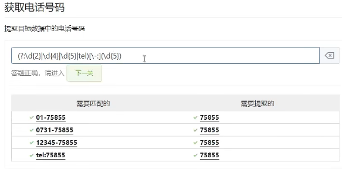
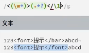
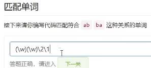
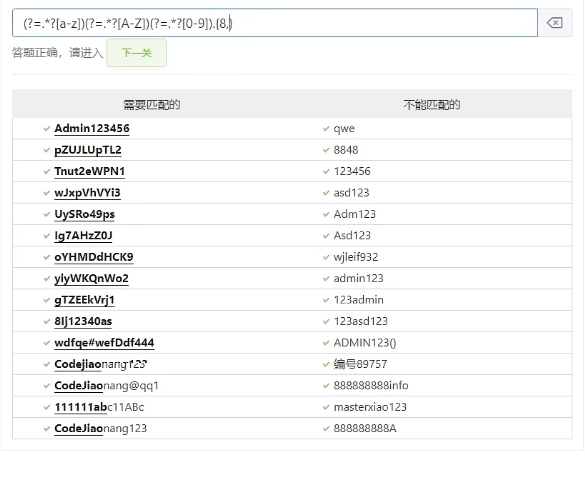

## 正则表达式

### 1.基础

字符组: 由“[]”包裹

```
[Pp]ython
Python python P[python]
# 区间
[a-zA-Z][0-9]
# 特殊字符 
[\-] ：\ 加上特殊字符
# 非集
[^a-z] ：匹配非小写字母的其他任何元素
```

快捷方式

```
\s:空白， 换行
\b   word\b:单词边界
\d:数字
\w：字母 \W:匹配特殊字符
非集：\S \B对应字母大写即可
```

字符的开始与结束

```
^:单词开始
实例：
python 123456 python
^python :  *python* 123456 python
$:以n结尾
python$ :  python 123456 *python*
```

任意字符

```
. :匹配任意字符,不能匹配换行符
```

可选字符

```
? :字符出现零次或一次 非贪婪模式
honur honr
honu?r : *honur* *honr*
```

范围、重复区间

```
\d{9}
\d{1,9} : 贪婪模式 有9个匹配9个
\d{8,9}? : 匹配8个数字不匹配9个，非贪婪模式
\d{3,} :匹配三个以上数字
```

速写

```
+ : 匹配1个到无数个 等价于 {1,}
* : ·匹配0个到无数个 等价于 {0,}

a
a1
a123
123456

a\d+ :

a
*a1*
*a123*
123456
```

### 2.分组、回溯、断言（环视）

#### 分组： 使用"()"

```
0731-8825951
(\d{4})-(\d{7})
Group 1: 0731
Group 2: 8825951

2019-5013-08
2019 5013 08
2019501308

(\d{4})[\-\s]?(\d{4})[\-\s]?(\d{2})

2019 5013 08
```

#### 或者条件

 ```
 使用管道符号 |
 (.jpg|.gif|.jpeg|.png) 
 匹配对应图片后缀
 ```

#### 非捕获分组：

当我们不需要获取某个分组的内容，但是又想使用分组的特性，此时就可以使用非捕获组(?:表达式)，从而不不捕获数据，还能使用分组的功能



#### 分组的回溯引用



```
<(\w+)>(.*?)</\1>
匹配html标签内容 (\w+)第一个分组 \1代表回溯第一个分组
```



#### 正向先行断言

```
喜欢(?=你)
匹配喜欢右边有你的字符，不会匹配‘你’
```

密码强度验证 必须包含 大小写字母 至少一个数字 至少8个字符



#### 反向先行断言

反向先行断言（?!表达式）作用是保证右边不能出现某个字符

```
喜欢(?!你)
匹配右边不是你的喜欢二字包含右边什么都没有的情况
```

#### 正向后行断言

(?<=表达式)，指在某个位置向左看，表示所在位置左侧必须能匹配

例如：如果要取出喜欢两个字，要求喜欢的前面有我，后面有你，此时

```
(?<=我)喜欢(?=你)
```

#### 反向后行断言

(?<!表达式)

例如：取出喜欢两个字，要求喜欢的前面没有我，后面没有你

```
(?<!我)喜欢(?!n)
```

